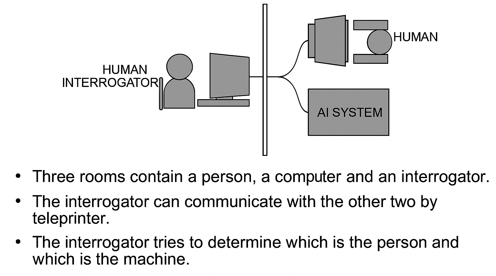
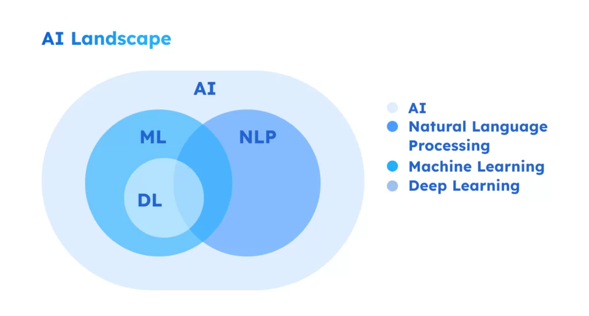
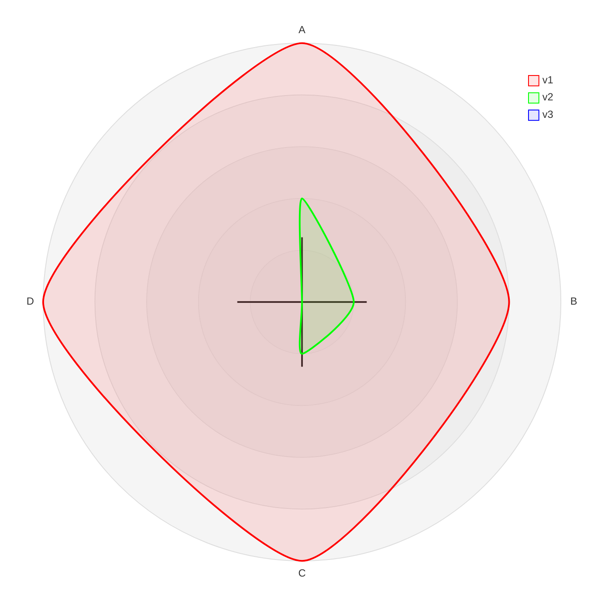
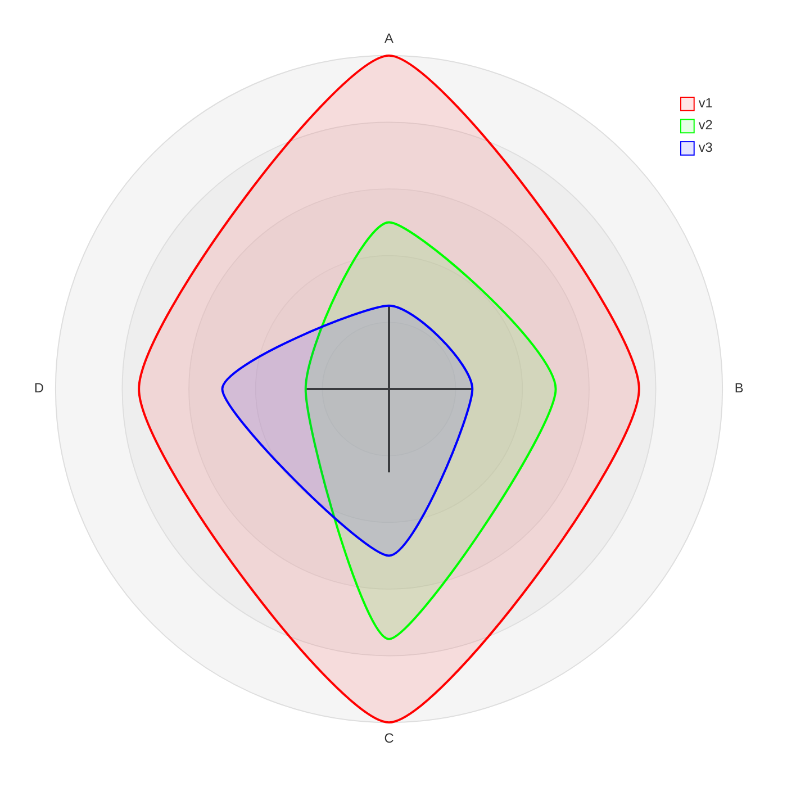
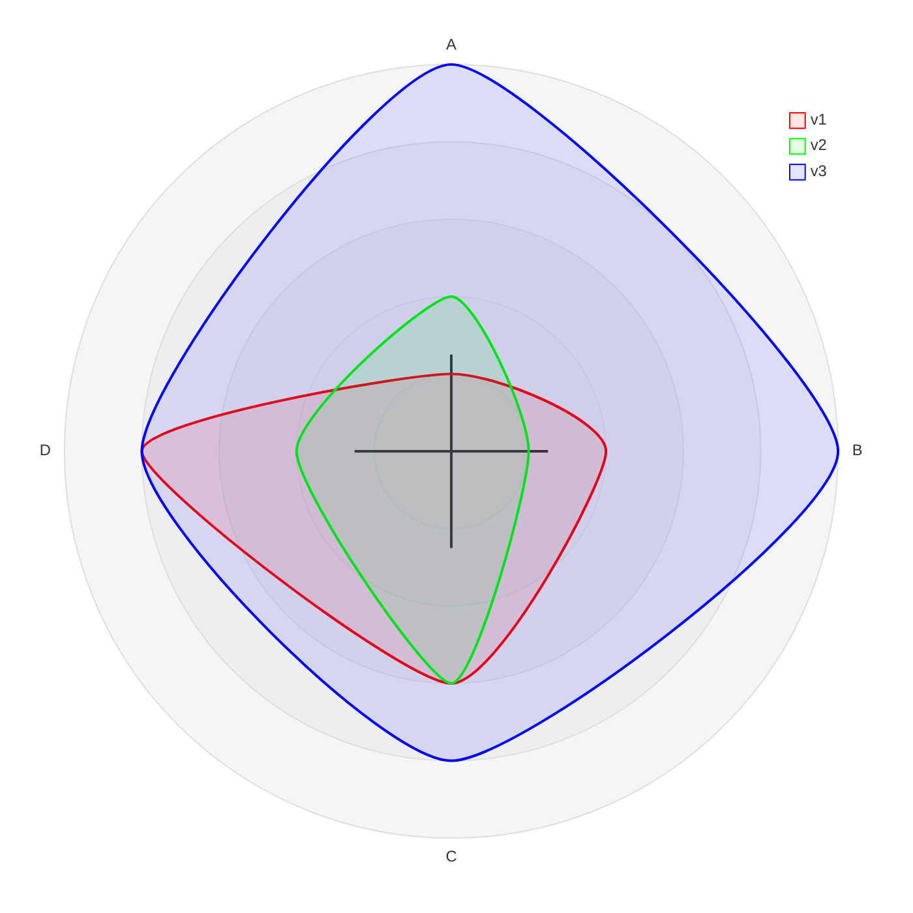
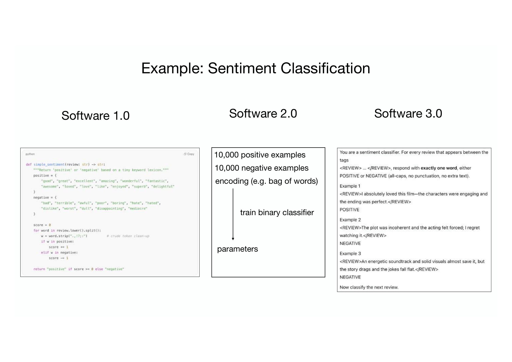
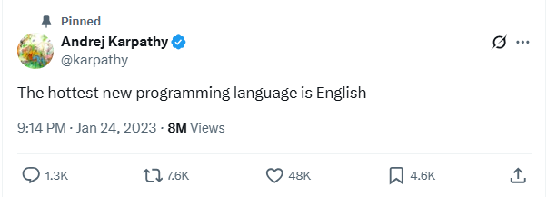

## AI Engineer Basics

### Brief history of AI, ML, DL

50s => today

| Period/Era                                                  | Year(s)                | Key Facts/Events                                                                                                                                                                                                                                      |
| :---------------------------------------------------------- | :--------------------- | :---------------------------------------------------------------------------------------------------------------------------------------------------------------------------------------------------------------------------------------------------- |
| **The Dawn of Artificial Intelligence: Symbolic Reasoning** | 1950                   | Alan Turing published "Computing Machinery and Intelligence," introducing the **Turing Test**. *Can machines think? <=> Can machine imitate human behavior?*  [🧪Touring machine visualizer (off-topic)](https://turingmachine.io/) [🧪Live tester](https://turingtest.live/)                                                                                                                                                  |
|                                                             | 1956                   | The **Dartmouth Workshop** is considered the birth of AI; the term "**Artificial Intelligence**" was coined. *"...every aspect of learning or any other feature of intelligence can in principle be so precisely described that a machine can be made to simulate it"* [📖Original document](https://www-formal.stanford.edu/jmc/history/dartmouth/dartmouth.html)                                                                                                                                                                                                                                                                      |
|                                                             | 1950s-1960s            | Early AI research focused on **symbolic reasoning**, problem-solving, and natural language processing, with programs like the **Logic Theorist** and the **General Problem Solver**.  *Logic Theorist*: The first program deliberately engineered to perform automated reasoning, Proved 38 of the first 52 theorems in Principia Mathematica [📖Manual](http://shelf1.library.cmu.edu/IMLS/MindModels/logictheorymachine.pdf)[🧠Propositional symbolic reasoning](https://www.erpelstolz.at/gateway/formular-uk-zentral.html)  *General Problem Solver*: Intended to work as a universal problem solver machine using means-ends analysis, solving problems expressed as well-formed formulas (logic puzzles, games) 
Back to present [🧪Lean prover](https://leanprover-community.github.io/logic_and_proof/) [📺Terence Tao](https://www.youtube.com/watch?v=_sTDSO74D8Q&t=1257s)     |
|                                                             | 1966                   | **ELIZA**, an NLP program, simulated a psychotherapist.  [🤖Simulator](https://www.masswerk.at/elizabot/)                                                                                                                                                                                         |
|                                                             | Late 1960s             | Initial optimism, but limitations of early AI systems (complexity, learning from data) became apparent.                                                                                                                                         |
| **The AI Winter: Reality Bites**                        | 1970s                  | Limitations of **symbolic AI** became evident, with systems struggling with common sense and uncertainty.                                                                                                                                         |
|                                                             | 1973                   | The **Lighthill Report** criticized AI research (hype vs progress, lack of impact, 'toy' problems rather than real-world applications), leading to significant funding cuts.                                                                                                                                                        |
|                                                             | 1970s                  | **Expert systems** emerged as a more practical application, using rule-based reasoning (e.g., **MYCIN** for medical diagnosis[📖implementation & rule](https://people.dbmi.columbia.edu/~ehs7001/Buchanan-Shortliffe-1984/Chapter-05.pdf)). - knowledge base: facts & rules - inference: apply rules to known facts to deduce new facts                                                                                                                                                                                                                                  |                                 |
| **The Renaissance of Expert Systems: A Commercial Success** | 1980s                  | Expert systems gained widespread adoption in industries like manufacturing, finance, and healthcare.                                                                  |
|                                                             | 1982                   | Japan launched the **Fifth Generation Computer Systems project**, boosting performance by using massive numbers of CPUs in parallel. Impact: Triggered international AI competition, leading to increased funding worldwide.                                                                                                                         |
|                                                             | Mid-1980s              | The market for expert systems began to decline due knowledge acquisition bottleneck, inability to learn from experience, maintenance nightmares as rule bases grew, couldn't handle uncertainty well.                                                                                                |
| **The Second AI Winter: Disappointment Returns**        | Late 1980s - Early 1990s | The expert system market collapsed, and funding for AI research declined again.                                                                                                                                                                   |
|                                                             | 1990s                  | A crucial shift towards more practical, **data-driven approaches** to AI began. - Statistical methods over symbolic reasoning - Learning from data instead of hand-coded rules - Pattern recognition and classification                                                                                                                                                                   |
| **The Rise of Machine Learning: Learning from Data**    | 1990s                  | **Statistical machine learning techniques**, such as **Support Vector Machines (SVMs)** and **Bayesian networks**, gained popularity.                                                                                                             |
|                                                             | 1997                   | **Deep Blue**, an IBM chess-playing computer (200 million chess positions evaluated per second, combination of [brute force search](https://stanford.edu/~cpiech/cs221/apps/deepBlue.html) and expert knowledge), defeated world chess champion Garry Kasparov  [📺Kasparov Resigns](https://www.youtube.com/watch?v=EsMk1Nbcs-s).                                                                                                                                                       |
|                                                             | 1997                   | **EMI** music composer created "Bach by Design"                 |
|                                                             | Late 1990s - 2000s     | **Data mining** and **knowledge discovery** became important applications of machine learning.                                                                                                                                                    |
|                                                             | 2000s                  | The availability of large datasets and increased computing power fueled more sophisticated ML algorithms, including **Ensemble methods** like Random Forests and Gradient Boosting Machines.                                                        |
| **The Deep Learning Revolution: Neural Networks Take Center Stage** | 2010s                   | Deep learning techniques were widely applied to natural language processing, speech recognition, computer vision, and robotics.                                                                                                                     |                                                                                                              |
|                                                             | 2011                  | IBM Watson's Jeopardy! Victory [🔗IBM research](https://www.ibm.com/history/watson-jeopardy)                                                                                                                    |
|                                                             | 2012                  | **AlexNet**, a deep convolutional neural network, achieved breakthrough performance in the ImageNet challenge for image recognition. [🔗Ilya Sutskever](https://x.com/ilyasut)                                                                                                                                                                                                                   |
|                                                             | 2014                   | The Turing Test Passed, **Goostman** chatbot:  33% of judges in a Royal Society contest believed they were conversing with a real person Facebook's **DeepFace** achieved near-human accuracy in facial recognition (97.35% accuracy on Labeled Faces in the Wild dataset vs Human performance: ~97.53%)                                                                                                                                                                       |
|                                                             | 2016                   | **AlphaGo**, a deep learning program, defeated world Go champion Lee Sedol. [📺Documentary](https://www.youtube.com/watch?v=WXuK6gekU1Y)                                                                                                                                                                       |
|                                                             | Present                | Deep learning continues to advance rapidly, becoming pervasive in modern life (virtual assistants, recommendation systems, self-driving cars, medical diagnosis). The rise of **Large Language Models (LLMs)** like **GPT-3** and **BERT** revolutionized NLP and generation. |                                                                      | 

**Lessons from AI History**
Cycles of Hype and Reality: AI has experienced multiple boom-bust cycles
Data is King: Success shifted from rule-based to data-driven approaches
Computing Power Matters: Each breakthrough coincided with increased computational resources
Specialization vs. Generalization: Trade-offs between narrow expert systems and general intelligence
*Software has not changed much for 70 years, it's changed twice in the last few years*

---

### AI vs ML vs DL

what's the difference?

- **Artificial Intelligence (AI)** is the broader concept of machines being able to carry out tasks in a way that we would consider "smart". It encompasses any technique that enables computers to mimic human intelligence, including rule-based systems, decision trees, and more.
- **Machine Learning (ML)** is a subset of AI that focuses on the development of algorithms that allow computers to learn from and make predictions or decisions based on data. ML systems improve their performance as they are exposed to more data over time.
- **Deep Learning (DL)** is a subset of ML that uses neural networks with many layers (deep networks) to analyze various factors of data. DL has been particularly successful in tasks such as image and speech recognition.

| Aspect | Artificial Intelligence (AI) | Machine Learning (ML) | Deep Learning (DL) |
|:---|:---|:---|:---|
| **Scope** | Big picture with broad field (all intelligent systems) | Subset of AI (data-driven learning) | Subset of ML (neural networks) |
| **Main Approach** | Rules, logic, smart robotics, and expert systems | Algorithms learning from data: linear regression, decision trees, clustering | Deep neural networks, big data |
| **Typical Data Needs** | Varies | Moderate to large | Very large |
| **Hardware Needs** | Varies | CPUs/GPUs | Heavy use of powerful GPUs |
| **Explainability** | Can be transparent | Typically traceable | Often a “black box” |
| **Example Applications** | Planning, chatbots, robotics | Spam filtering, loan scoring, recommendation engines, fraud detection | Image recognition, voice assistants, speech-to-text, self-driving car vision systems |

---

### AGI / ASI

**Artificial General Intelligence (AGI)** refers to a type of AI that possesses the ability to understand, learn, and apply knowledge across a wide range of tasks at a level comparable to human intelligence. Unlike narrow AI, which is designed for specific tasks (like image recognition or language translation), AGI aims to perform any intellectual task that a human can do.
[📖Paper](https://arxiv.org/pdf/2311.02462.pdf)

Performance x Generality

**Table 1: A leveled, matrixed approach toward classifying systems on the path to AGI based on depth (performance) and breadth (generality) of capabilities.**

| Performance (rows) x Generality (columns) | Narrow clearly scoped task or set of tasks | General wide range of non-physical tasks, including metacognitive tasks like learning new skills |
| :---------------------------------------- | :----------------------------------------- | :---------------------------------------------------------------------------------------- |
| **Level 0: No AI**                        | Narrow Non-AI calculator software; compiler | General Non-AI human-in-the-loop computing, e.g., [🔗Amazon Mechanical Turk](https://www.mturk.com/)                  |
| **Level 1: Emerging** equal to or somewhat better than an unskilled human | Emerging Narrow AI GOFAI (Boden, 2014); simple rule-based systems, e.g., SHRDLU (Winograd, 1971) | Emerging AGI ChatGPT (OpenAI, 2023), Bard (Anil et al., 2023), Llama 2 (Touvron et al., 2023), Gemini (Pichai & Hassabis, 2023) |
| **Level 2: Competent** at least 50th percentile of skilled adults | Competent Narrow AI toxicity detectors such as Jigsaw (Das et al., 2022); Smart Speakers such as Siri (Apple), Alexa (Amazon), or Google Assistant (Google); VQA systems such as PaLI (Chen et al., 2023); Watson (IBM); SOTA LLMs for a subset of tasks (e.g., short essay writing, simple coding) | Competent AGI not yet achieved ***???***                                                          |
| **Level 3: Expert** at least 90th percentile of skilled adults | Expert Narrow AI spelling & grammar checkers such as Grammarly (Grammarly, 2023); generative image models such as Imagen (Saharia et al., 2022) or Dall-E 2 (Ramesh et al., 2022) | Expert AGI not yet achieved                                                              |
| **Level 4: Virtuoso** at least 99th percentile of skilled adults | Virtuoso Narrow AI Deep Blue (Campbell et al., 2002), AlphaGo (Silver et al., 2016; 2017) | Virtuoso AGI not yet achieved                                                            |
| **Level 5: Superhuman** outperforms 100% of humans | Superhuman Narrow AI AlphaFold (Jumper et al., 2021; Varadi et al., 2021), AlphaZero (Silver et al., 2018), StockFish (Stockfish, 2023) | Artificial Superintelligence (ASI) not yet achieved                                      |

Autonomy Levels & Risks

**Table 2: More capable AI systems unlock new human-AI interaction paradigms.**

| Autonomy Level | Example Systems | Unlocking AGI Level(s) | Example Risks Introduced |
| :--------------------------------------- | :------------------------------------------------ | :------------------------------------- | :------------------------------------- |
| **Autonomy Level 0: No AI** human does everything | Analogue approaches (e.g., sketching with pencil on paper); Non-AI digital workflows (e.g., typing in a text editor; drawing in a paint program) | No AI n/a | n/a (status quo risks) |
| **Autonomy Level 1: AI as a Tool** human fully controls task and uses AI to automate mundane sub-tasks | Information-seeking with the aid of a search engine; Revising writing with the aid of a grammar-checking program; Reading a sign with a machine translation app | Possible: Emerging Narrow AI; Likely: Competent Narrow AI | de-skilling (e.g., over-reliance); disruption of established industries |
| **Autonomy Level 2: AI as a Consultant** AI takes on a substantive role, but only when invoked by a human | Relying on a language model to summarize a set of documents; Accelerating computer programming with a code-generating model; Consuming most entertainment via a sophisticated recommender system | Possible: Competent Narrow AI; Likely: Expert Narrow AI; Emerging AGI | over-trust; radicalization; targeted manipulation |
| **Autonomy Level 3: AI as a Collaborator** co-equal human-AI collaboration; interactive coordination of goals & tasks [📖Distant writing](https://papers.ssrn.com/sol3/papers.cfm?abstract_id=5232088)| Training as a chess player through interactions with and analysis of a chess-playing AI; Entertainment via social interactions with AI-generated personalities | Possible: Emerging AGI; Likely: Expert Narrow AI; Competent AGI | anthropomorphization (e.g., parasocial relationships); rapid societal change |
| **Autonomy Level 4: AI as an Expert** AI drives interaction; human provides guidance & feedback or performs sub-tasks | Using an AI system to advance scientific discovery (e.g., protein-folding) | Possible: Virtuoso Narrow AI; Likely: Expert AGI | societal-scale ennui; mass labor displacement; decline of human exceptionalism |
| **Autonomy Level 5: AI as an Agent** fully autonomous AI | Autonomous AI-powered personal assistants (not yet unlocked) | Likely: Virtuoso AGI; ASI | misalignment[🔗Paperclip maximizer](./paperclip-maximiser.md); concentration of power  [📖AI 2027 Report](https://ai-2027.com/) [📺AI 2027 Video](https://www.youtube.com/watch?v=5KVDDfAkRgc) |

**Artificial Superintelligence (ASI)** refers to a level of artificial intelligence that surpasses human intelligence across all domains, including creativity, problem-solving, emotional intelligence, and social skills. ASI would not only be capable of performing any intellectual task that a human can do but would do so with greater efficiency, speed, and accuracy. The concept of ASI is often associated with the idea of a "technological **singularity**", a hypothetical point in the future when AI systems become self-improving and rapidly evolve beyond human control or understanding.

---

### Software Evolution

| Version | Description                                                                                                   | Programming Paradigm                                   | Visualization                                                                                           |
|------------------|---------------------------------------------------------------------------------------------------------------|--------------------------------------------------------|--------------------------------------------------------------------------------------------------------------------------|
| **1.0** _code_ | Traditional programming where developers write explicit instructions for computers to follow                   | `computer code => programs => computer` input => output                | [🔗Github Map](https://anvaka.github.io/map-of-github)                                                                   |
| **2.0** _weights_ | Developers create datasets, run optimizer to create the parameters of the neural network                      | `weights => programs => neural net` fixed function neural net for a more or less specific task                    | [🔗HuggingFace Model Atlas](https://huggingface.co/spaces/Eliahu/Model-Atlas)                                            |
| **3.0** _prompts_ | Developers create prompts that guide the behavior of LLMs to perform a wide range of tasks | `prompts => programs => LLM` LLM as a programmable neural net                           | [🔗Word embeddings](https://helboukkouri.github.io/embedding-visualization/)  [🔗TensorFlow Projector](https://projector.tensorflow.org/) |  

#### paradigm quota evolution: v1+v2!=v3

early past > present > future

<table>
<tr>
<td>

</td>
<td>

</td>
<td>

</td>

</tr>
</table>

v1/v2/v3 how to solve tasks

 

#### hottest programming language
The **TIOBE Index** indicator of the popularity of programming languages: [🔗Index](https://www.tiobe.com/tiobe-index/)

is...

#### 🚀 demo

[🧪Spam detector naive bayes](spam-detector.ipynb)

---

### LLM as software filter

[🔗LLM as software filter](https://x.com/8teAPi/status/1653630970602614785)

| Feature              | Hardware (The iPhone Filter)                                                                                              | Software (The LLM Filter)                                                                                                                              |
|:----------------------------|:--------------------------------------------------------------------------------------------------------------------------|:-------------------------------------------------------------------------------------------------------------------------------------------------------|
| **Convergence**                 | Consolidated numerous single-purpose physical devices (camera, GPS, phone, music player) into a single piece of hardware. | Consolidates numerous single-purpose applications and digital workflows (search, word processing, email) into a single interface.                      |
| **Interface Shift**             | From physical buttons, styluses, and keyboards to capacitive multi-touch.                                                 | From explicit command syntax and structured interfaces to natural language conversations.                                                              |
| | | |
| Act as                     | **Replacement**: it was a direct replacement for older hardware. Shift from physical devices => apps in device                    | **Abstraction**: abstraction layer or orchestrator. It controls specialized software in the background rather than fully replacing it for power users. |
| Benefit                 | **Physical**: reduced pocket/bag clutter and fewer devices to own and manage.               | **Cognitive**: reduced cognitive load, streamlined workflows, technical debt, advanced reasoning capabilities accessible to non-technical users.                        |

---                                   

### OS Evolution                                                

A new OS

| Era                      | Key Technologies                                                   | Software / Development / Deploy| Security              | Resources                                             |
| ------------------------ | ------------------------------------------------------------------ | --------------------------------------------------------------------------------------------------------------------------------- | ------------------------------------------------------------------------------------------ | ---------------------- |
| **1.0** *local* `hardware management`      | Classical OS (Windows, Linux, macOS), compilers, IDEs, virtualization                                      | Software tightly bound to local machine or VM. Developers manage dependencies, builds, deployment pipelines manually | • User accounts • File permissions • Antivirus software • Physical security | [🔗History of Operating Systems](https://en.wikipedia.org/wiki/History_of_operating_systems) |
| **2.0** *cloud* `infrastructure abstraction`      | Virtualized cloud infra (AWS, Azure, Google Cloud), containers, Kubernetes, serverless, CI/CD, SaaS/PaaS platforms       | Software decoupled from local machine. Elastic infra, managed services, API economy. Deployment → automation + orchestration      | • Identity providers • API authentication • Network security • Compliance frameworks                                       | [🔗Cloud Native Landscape](https://landscape.cncf.io/)|
| **3.0** *llm* `weights + prompts` | LLMs as central runtime, tool orchestration (APIs, plugins, agents), context windows + embeddings, multi-modal I/O | Development shifts from coding algorithms to prompting + orchestrating AI agents. Deployment → AI-enabled workflows and co-pilots, vibe coding | • Prompt injection • Content filtering • Privacy preservation • Explainable AI • Bias mitigation • Ethical considerations |  |

