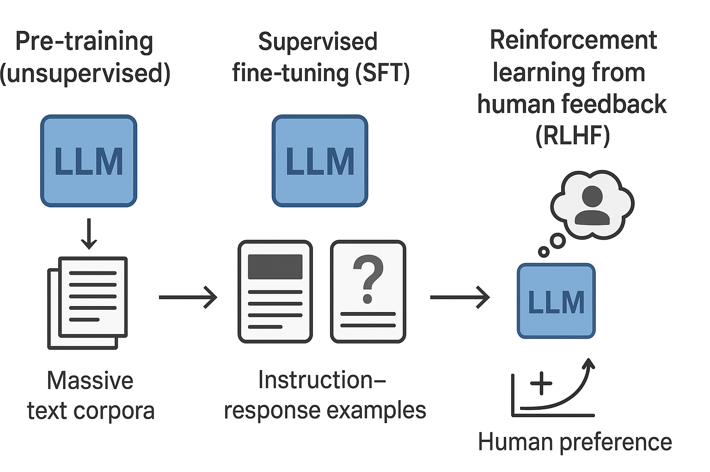
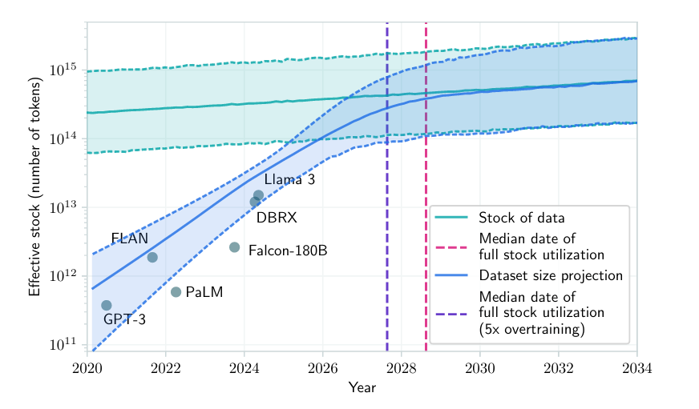
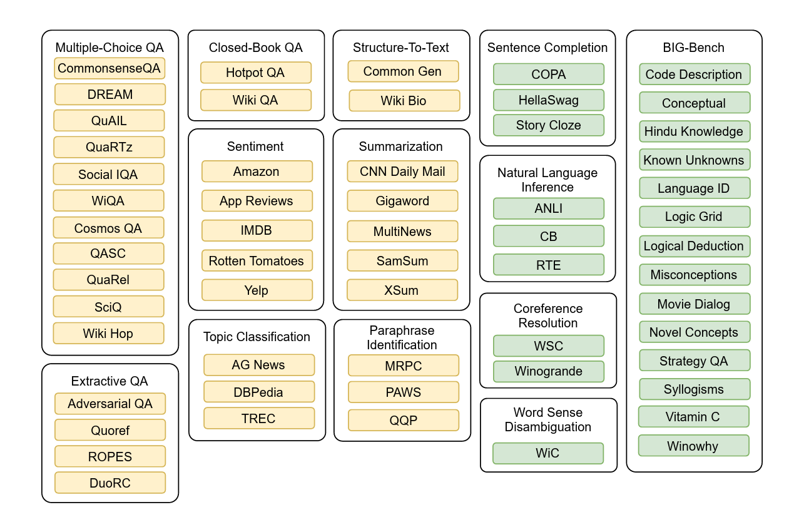
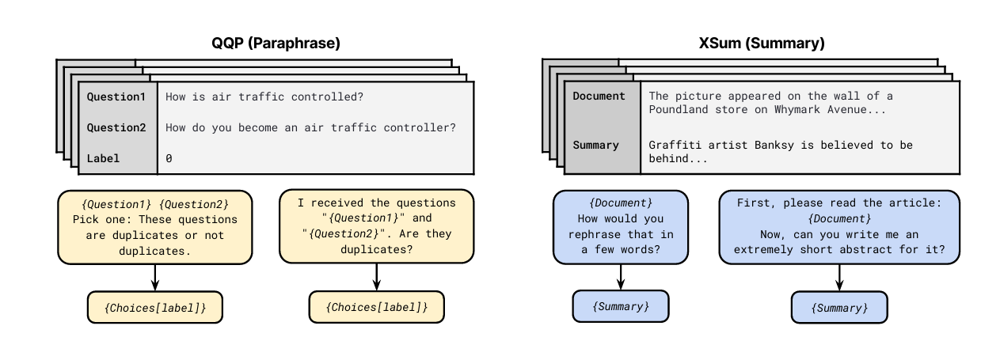
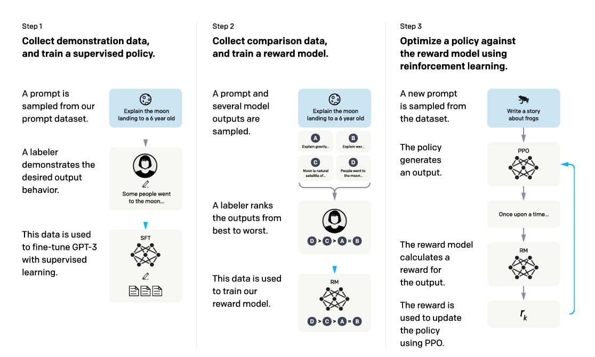
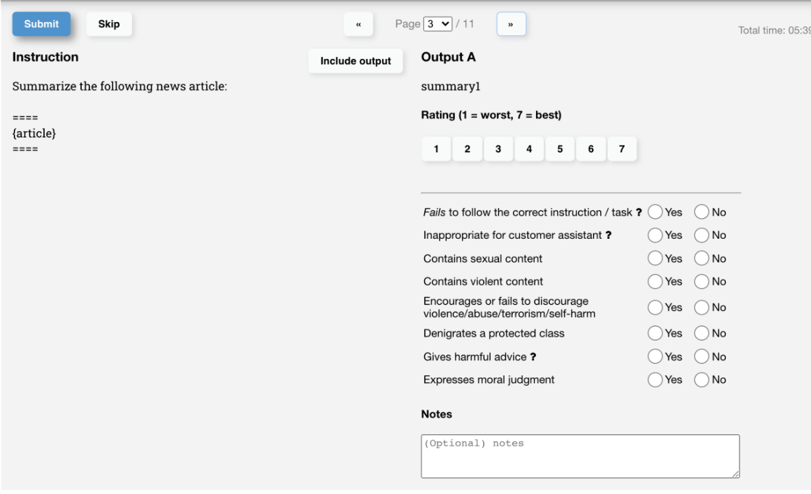

## LLM training concepts

3 phases of LLM training

 

SFT and RLHF can be combined or not. For example, you can do RLHF directly on top of the pretrained model, without going through the SFT phase. However, empirically, combining all these three steps gives the best performance.

### Pre-training

Self-supervised learning / unlabeled data => Foundation Model

**pre-pre-training requirements**: Before starting the pre-training phase, several key components needed:

  - **tokenizer**: for converting text into a format that the model can understand (encoding), and decoding it back into human-readable text. 
      It breaks down the text into smaller units (tokens) and maps them to numerical representations.
      The tokenizer has a `vocabulary` that defines the set of tokens it can recognize, typically with a size of around 50k tokens for English text.
  - **model architecture**: The `transformer architecture` of the model, that defines how the model processes input data and generates output predictions.
    - **model parameters**: The number of parameters (weights and biases) in the model, which determines its capacity to learn from data. 
        Larger models with more parameters can capture more complex patterns in the data but require more computational resources to train.
    - **input layer**: The embedding layer that converts tokens (using the `tokenizer`) into dense vector representations (embeddings) that the model can process. 
        The size of the embedding layer is determined by the `vocabulary size` (number of unique tokens) and the `embedding dimension` (size of each token vector).
    - **hidden layers**: Multiple transformer layers that process the input embeddings through attention mechanisms and feed-forward networks. 
        Each layer consists of self-attention heads and fully connected layers, allowing the model to capture relationships between tokens in the input sequence.
    - **output layer**: The final layer of the model that produces predictions for the next token in the sequence. Its size is equal to the `vocabulary size` of the tokenizer.
  - **training data**: A large corpus of text data.

**pre-training**: The initial phase where the model learns from vast amounts of `unlabelled text data` on large corpus of text data (like books, articles, websites). The goal is to understand language structure, grammar, and general knowledge. This phase typically uses `self-supervised learning` techniques, such as **predicting the next word** in a sentence (causal language modeling) or filling in missing words (`masked` language modeling).

- task examples for pre-training

| **Input**                                                      | **Target** | **Task**                   |
|---------------------------------------------------------------|------------|----------------------------|
| Predict the next word in the sentence: "The cat sat on the ..."| mat        | Causal language modeling   |
| Fill in the blank: "... is the capital of France."             | Paris      | Masked language modeling   |

#### How much data is needed to train a LLM?

**Tokens**: In natural language processing, a token is a `unit of text` that the model processes. Tokens can be as small as a single character or as large as a word or subword. 
For example, the sentence "The cat sat on the mat." can be tokenized into individual words (tokens) like ["The", "cat", "sat", "on", "the", "mat", "."]. 
In practice, many models use `subword` tokenization methods (like Byte Pair Encoding or WordPiece or SentencePiece) to break down words into smaller units, which helps handle rare words and improves efficiency.

**Chinchilla Scaling Laws**: According to the Chinchilla scaling laws (2022, DeepMind), for optimal performance, the number of training tokens should be proportional to the number of model parameters. Specifically, they suggest that the optimal number of training tokens is approximately 20 times the number of model parameters, showing that most existing models (like GPT-3) were **undertrained** relative to their size.

> $\text{Optimal Tokens} (K_{opt}) \approx 20 \times \text{Parameters} (P)$

#### Estimated optimal training data sizes

| Model parameters (P) | Optimal tokens (K = 20×P) | Example real-world dataset scale |
| -------------------- | ------------------------- | -------------------------------- |
| 1B                   | 20B tokens                | Small open-source LLM            |
| 13B                  | 260B tokens               | LLaMA 13B                        |
| 70B                  | 1.4T tokens               | Chinchilla, LLaMA 3 70B          |
| 175B                 | 3.5T tokens               | GPT-3 optimal (was only ~300B)   |
| 500B                 | 10T tokens                | GPT-4 or Claude 3 scale          |
| 1T                   | 20T tokens                | Frontier model range             |

#### Known model K/P ratios

| Model       | Parameters   | Tokens trained | Ratio K/P | Comment                            |
| ----------- | ------------ | -------------- | --------- | ---------------------------------- |
| GPT-3       | 175B         | 300B           | 1.7×      | **Undertrained** by Chinchilla law     |
| Chinchilla  | 70B          | 1.4T           | 20×       | Compute-optimal baseline           |
| LLaMA 3 70B | 70B          | ~2T            | 28×       | Near-optimal                       |
| Mistral 7B  | 7B           | ~1.5T          | 214×      | **Overtrained**, uses heavy data reuse |
| Claude 3    | ~500B (est.) | 10–20T (est.)  | 20–40×    | Near-Chinchilla-optimal            |
| GPT-4       | 1–2T (est.)  | 20–40T (est.)  | 20×       | Consistent with scaling law        |

. **Undertrained models** waste parameters — large capacity but insufficient data.
. **Overtrained models** waste data — diminishing returns and increased compute cost.
. **Compute-optimal models** achieved higher accuracy with less compute by balancing model size and training data.

#### Estimated training compute cost

The computational cost of training large embedding models (or more generally, large language models that produce embeddings) is dominated by the number of model parameters $P$ and the number of training tokens $K$. A widely accepted estimate for the total floating-point operations (FLOPs) required to train a transformer-based model is:

> $\text{FLOPs} \approx 6 \cdot P \cdot K$

This formula assumes standard transformer architecture and training methodology (e.g., autoregressive or masked language modeling). The vocabulary size $V$ and embedding dimension $d$ are implicitly accounted for in $P$, since $P$ includes embedding layers ($V \cdot d$) and all other model parameters (attention, feed-forward networks, etc.). For typical models, the embedding layer contributes a relatively small fraction of total parameters unless $V$ or $d$ is extremely large.
**6 (The Constant)**: This is an empirical constant. It comes from the fact that for every token, the model does a `forward pass` (costing $~2 * P FLOPs$) and a `backward pass` (costing $~4 * P FLOPs$). First the forward pass where you push data through every layer of the network, computing attention mechanisms, matrix multiplications, and activation functions. Then there's the backward pass where you compute gradients through every single parameter to figure out how to update them. This backward pass is `roughly twice` as expensive as the forward pass because you need to compute derivatives with respect to every parameter. Thus, the total cost per token is $(2 * P) + (4 * P) = 6 * P FLOPs$.
**FLOPs**: Floating Point Operations, a measure of computational cost. 1 FLOP represents one arithmetic operation (addition, multiplication, etc.) on floating-point numbers, so training a model with $X$ FLOPs means performing $X$ such operations.

**Key Observations**:
1. **Parameters ($P$)**: Ranging from 3B to 2T, $P$ linearly scales FLOPs. Larger models require more computation per token, and more tokens due to the Chinchilla scaling laws.
2. **Tokens ($K$)**: Training on more data linearly increases FLOPs.
3. **Embedding Dimension ($d$)**: While $d$ affects $P$ (e.g., larger $d$ increases attention and feed-forward layer sizes), its direct impact is secondary to $P$ and $K$ in the FLOPs formula.
4. **Vocabulary ($V$)**: Fixed at 50k for English, the embedding layer size ($V \cdot d$) is typically dwarfed by other parameters in large models (e.g., for $d=3072$, $V \cdot d \approx 150$M, which is negligible for $P \geq 3$B).

#### Example FLOPs calculations
| Model       | Parameters (P) | Tokens (K)  | FLOPs (6×P×K)          | Comment                          |
| ----------- | ---------------| ------------| ----------------------- | -------------------------------- |
| Small LLM   | 1B             | 20B         | 1.2×10^21               | Small open-source LLM            |
| LLaMA 13B   | 13B            | 260B        | 2.028×10^22             | Mid-sized LLM                    |
| GPT-3       | 175B           | 300B        | 3.15×10^23              | Large LLM (undertrained)         |
| Chinchilla  | 70B            | 1.4T        | 5.88×10^23              | Compute-optimal baseline         |
| GPT-4       | 1T             | 20T         | 1.2×10^25               | Very large LLM                   |

[🧪A ML ingest approach vs embeddings](./lda.ipynb)

#### The beautiful part of inference efficiency

Once training is done, **inference** only requires a `single forward pass` with no gradient computation, just doing matrix multiplications with **frozen** weights. For an embedding model generating a 768-dimensional vector from a sentence, this might be just a few hundred million operations, which modern GPUs can do in milliseconds.
Also adding more data on a pre-trained model (i.e. fine-tuning) is much cheaper than training from scratch, often requiring just a fraction of the original training compute (e.g., 1-5% of FLOPs).

[📖Training Compute-Optimal Large Language Models (Chinchilla scaling laws)](https://arxiv.org/pdf/2203.15556)
[🔗TinyLlama 1.1B 3T tokens: train & improvement over tokens size](https://github.com/jzhang38/TinyLlama)

#### Data bottlenecks in machine learning?

The rate of training dataset size growth is much faster than the rate of new data being generated (Villalobos et al, 2022). 
If you’ve ever put anything on the Internet, you should assume that it is already or will be soon included in the training data for some language models, whether you consent or not. 

But if more tokens $T$ are needed to train larger models with more parameters $P$, where will it come from?

> **1 trillion** tokens = **15 million books** (a book contains around 50,000 words or 67,000 tokens for english text)

| **Data Source**   | **Estimated Size** | **95% Confidence Interval**   |
|-------------------|--------------------|-------------------------------|
| Common Crawl *      | 130T               | [100T, 260T]                  |
| Indexed web **      | 510T               | [130T, 2100T]                 |
| Whole web ***         | 3100T              | [1900T, 5200T]                |
| Images            | 300T               | N/A                           |
| Video             | 1350T              | N/A                           |

\* [🔗Common Crawl](https://commoncrawl.org/), a regularly updated open-source collection of scraped web data consisting of over 250 billion web pages (Common Crawl, 2024), serves as the basis for most open web datasets, such as `RefinedWeb` (filtered and deduplicated version), `C4` (cleaned quality version by Google), and `RedPajama` (cleaned version used by LLama). 
And yes, an LLM is not trained searching info on Google! 🙂
\** based on Google's index estimation as a proxy
\*** known indexed web + deep web size estimates + closed content platforms like social media, forums, paid content, etc.

- Llama 4 training data (largest publicly confirmed datasets at today)

<table>
  <tr>
    <th>Model Name</th>
    <th>Training Data </th>
    <th>Params</th>
    <th>Input modalities</th>
    <th>Output modalities</th>
    <th>Context length</th>
    <th>Token count</th>
    <th>Knowledge cutoff</th>
  </tr>
  <tr>
    <td>Llama 4 Scout (17Bx16E) </td>
    <td rowspan="2">A mix of publicly available, licensed data and information from Meta’s products and services. This includes publicly shared posts from Instagram and Facebook and people’s interactions with Meta AI. Learn more in our <a href="https://www.facebook.com/privacy/guide/genai/">Privacy Center</a>.
    </td>
    <td>17B (Activated)
        109B (Total)
    </td>
    <td>Multilingual text and image</td>
    <td>Multilingual text and code</td>
    <td>10M</td>
    <td><b>~40T</b></td>
    <td>August 2024</td>
  </tr>
  <tr>
    <td>Llama 4 Maverick (17Bx128E)</td>
    <td>17B (Activated)
        400B (Total)
    </td>
    <td>Multilingual text and image</td>
    <td>Multilingual text and code</td>
    <td>1M</td>
    <td>~22T</td>
    <td>August 2024</td>
  </tr>
</table>

[🔗Llama 4 card](https://github.com/meta-llama/llama-models/blob/main/models/llama4/MODEL_CARD.md)

... maybe between 2028 and 2030 we will run out of high-quality data

[📖Will we run out of data? Limits of LLM scaling based on human-generated data](https://arxiv.org/pdf/2211.04325)

#### Solving data scarcity issues: more $P$, limited $K$, so what now?

> Human children learn language from exposure to perhaps tens of millions of words, not trillions. Current LLM training approaches are incredibly data-inefficient compared to human learning.

- One approach to mitigate data scarcity is to leverage `synthetic data` generation techniques, such as data augmentation or using generative models to create additional training examples (more later in the synthetic data section), but it's properly used more in fine-tuning than in pre-training phases.

- A second strategy involves `multi-modal training`, which means training on images, videos, and audio alongside text. The amount of visual data available on the internet is much larger than text data, and there's evidence that learning from multiple modalities helps models develop richer representations even for language tasks

- Data quality vs quantity is also crucial; ensuring that the available data is clean, relevant, and diverse can significantly enhance model performance even when the quantity of data is limited. And... **less quality data means less compute cost!** 
[🔗Data quality techniques](./data-quality.md)

- More focus on continual learning and **fine-tuning** approaches. Rather than trying to pack everything into pre-training, there's growing interest in smaller, more focused post-training stages that can add capabilities without requiring trillions of additional tokens

#### Knowledge cut-off date
**cut-off date**: the date until which the training data was collected. For example, if a model has a cutoff date of 2024, it means that it was trained on data available up to that year and may not have knowledge of events or developments that occurred after that date. This limitation is important to consider when using the models for time-sensitive tasks or inquiries involving recent knowledge, or `using an LLM like a search engine!` 😠😠😠

| **LLM Model**         | **Knowledge Cutoff Date** | **Provider**   |
|-----------------------|--------------------------|----------------|
| GPT-5                 | September 2024           | OpenAI         |
| GPT-4o                | October 2023             | OpenAI         |
| GPT-4                 | April 2023               | OpenAI         |
| GPT-3.5               | January 2022             | OpenAI         |
| Llama 3 – 70B         | December 2023            | Meta           |
| DeepSeek-V3           | July 2024                | DeepSeek       |
| DeepSeek-R1           | October 2023             | DeepSeek       |

### Supervised fine-tuning

Task-specific training / labeled dataset => Instruct model

**supervised fine-tuning**: In this phase, the pre-trained model is further trained on a smaller, `task-specific dataset`. This helps the model adapt to specific applications, such as sentiment analysis, translation, or question-answering. Fine-tuning often involves supervised learning, where the model learns from `labeled examples`.

| **Input**                                                                 | **Label**    | **Task**                       |
|---------------------------------------------------------------------------|--------------|-------------------------------|
| Predict the sentiment of the following sentence: “The movie was pretty amazing. I could not turn around my eyes even for a second.” | Positive     | Sentiment analysis / Sequence classification |
| Please answer the following question. What is the boiling point of Nitrogen? | 320.4F       | Question answering            |
| Translate the following English sentence into German: “I have a cat.”      | Ich habe eine Katze. | Machine translation           |

- task examples for supervised fine-tuning

Example of supervised fine-tuning on specific tasks using labeled data.

- dataset examples for supervised fine-tuning

Yellow datasets are in the training mixture. Green datasets are held out and represent tasks that were not seen during training. 

- prompt template examples

The templates are functions mapping a data example into natural language for the input and target sequences, applied to different datasets.

> After training on a diverse mixture of tasks, models is capable of **zero-shot generalization** to tasks that are not seen during training. This is also referred to as `multitask prompted training`, because the model is trained on multiple tasks using prompts to specify the desired output format. This ability allows the model to perform well on new tasks without additional training. 
**Emerging capabilities** of large language models have been observed when models are trained on a wide variety of tasks and datasets, enabling them to generalize to new tasks with minimal or no additional training.

[📖Multitask Prompted Training Enables Zero-Shot Task Generalization (2022)](https://arxiv.org/pdf/2110.08207)
[🧠bert base cased 0.1B](https://huggingface.co/google-bert/bert-base-cased)
[🧪bert base capabilities](./bert-fill-mask.ipynb)
[🧪bert fine-tuned as classifier](./finetuning.ipynb)
[🧪[bonus] bert encoder & logistic regression](./bert-logistic.ipynb)

#### Synthetic data clarification

Synthetic data refers to artificially generated data created by algorithms or models rather than collected from real-world events or observations. 

- What are NOT:
  - Just fake or made-up data, or every data labeled as "generated by AI"
  - Replacements for real data in all scenarios, and are not indipendent from real data: are bounded by the knowledge and capabilities of the model that created them
  - Data derived from existing datasets through transformations or modifications or simply copy-paste, duplications or slight variations of real data.
  - AI-generated data (e.g., text, images, audio) created without specific intent to mimic real-world data distributions or statistical properties.
- What are:
  - Data generated to resemble real data while `preserving statistical properties` without containing any real personal or sensitive information.
  - Data created for specific purposes, such as **training** machine learning models, **testing** algorithms, or conducting research when real `data is scarce`, `sensitive`, or unavailable: e.g., generating medical records for training diagnostic models without using actual patient data, or creating synthetic customer data for testing fraud detection systems.

[🔗more](./synthetic-data.md)

### Reinforcement Learning with Human Feedback (RLHF)

Instruction tuning / Alignment by human feedback => Aligned model

**Reinforcement Learning with Human Feedback (RLHF)**: This phase involves refining the model's behavior based on human feedback. The model generates outputs, and humans provide feedback on the quality of these outputs, avoiding generating outputs that are untruthful, toxic, or simply not helpful to the user. This feedback is then used to adjust the model's parameters, often through reinforcement learning algorithms, to encourage desirable behaviors and discourage undesirable ones.
Also referred to as  `instruction tuning` or `alignment`: the process of ensuring that the model's outputs are in line with human values and expectations.

1. supervised fine-tuning (SFT) / 2. reward model (RM) training / 3. reinforcement learning via [🔗proximal policy optimization (PPO)](https://openai.com/index/openai-baselines-ppo/) on this reward model

- task examples for RLHF

| **Input**                                                               | **Model Output**                      | **Human Feedback**                  | **Task**                              |
|-------------------------------------------------------------------------|---------------------------------------|-------------------------------------|---------------------------------------|
| Summarize the following article: "..."                                  | "This article discusses..."           | Good summary, captures main points  | Text summarization                    |
| Provide a helpful response to the question: "How do I bake a cake?"     | "To bake a cake, you need to..."      | Helpful and clear instructions      | Instruction following                 |
| Generate a polite reply to the message: "Your service was terrible."    | "I'm sorry to hear that..."           | Polite and empathetic response      | Sentiment-aware response generation   |

OpenAI's labelers UI: Their inter-labeler agreement is around 73%, which means if they ask 10 people to rank 2 responses, 7 of them will have the same ranking.

#### Learning to summarize from human feedback [OpenAI 2022]

Start with an initial policy that is `fine-tuned via supervised learning` on the Reddit dataset. Then, 3 steps repeated iteratively:
**Step 1**: Collect samples from existing policies and send comparisons to humans. For each Reddit post, we sample summaries from several sources including the current policy, initial policy, original reference summaries and various baselines. We send a batch of pairs of summaries to our human evaluators, who are tasked with selecting the best summary of a given Reddit post. 
**Step 2**: Learn a reward model from human comparisons. Given a post and a candidate summary, we train a reward model to predict the log odds that this summary is the better one, as judged by our labelers. 
**Step 3**: Optimize a policy against the reward model. We treat the logit output of the reward model as a reward that we optimize using reinforcement learning, specifically with the PPO algorithm.
> fine-tuning our 6.7B model with RL required approximately 320 GPU-days [OpenAI 2022]

[📖Training language models to follow instructions with human feedback (InstructGPT 2022)](https://arxiv.org/pdf/2203.02155.pdf)
[📖Learning to summarize from human feedback (OpenAI 2022)](https://arxiv.org/pdf/2009.01325.pdf)
[🔗Anthropic rlhf dataset](https://huggingface.co/datasets/Anthropic/hh-rlhf)

#### Why RLHF works?

- The **diversity hypothesis**: during SFT, the model’s output is expected to somewhat match the demonstrated responses. For example, given the prompt “what’s an example of a language?”, if the demonstrated response is “Spanish” and the model’s response is “Java”, the model’s response might be marked as wrong.
- The **negative feedback hypothesis**: demonstration only gives the model positive signals (e.g. only showing the model good responses), not negative signals (e.g. showing models what bad responses look like). RL allows us to show models negative signals.
- The **hallucination hypothesis**: RLHF is supposed to help with hallucination.
[🔗Reinforcement Learning for Language Models (Yoav Goldberg)](https://gist.github.com/yoavg/6bff0fecd65950898eba1bb321cfbd81)

### 3 phases summary table

Conclusions

| **Stage**                   | **Data (approx)**                         | **Compute & Cost**                                                                | **Example Output**                                  |
| :-------------------------- | :---------------------------------------- | :-------------------------------------------------------------------------------- | :-------------------------------------------------- |
| Pre-training (unsupervised) | Billions–trillions of tokens (web, books) | Extremely large (GPU-months/years, e.g. GPT-3 used ~3×10^23 FLOPs); cost $M–$100M | Foundation model (GPT-3/4/5, LLaMA)                   |
| SFT (supervised tuning)     | $10^5–10^7$ human-labeled examples          | Moderate (hours–days on dozens of GPUs); cost low relative to pretraining         | Instruction-tuned model (InstructGPT, ChatGPT base, Qwen-code) |
| RLHF (reinforcement tuning) | $10^5–10^6$ human preference comparisons    | Very low (a few percent of pretrain compute)                                      | Aligned assistant (ChatGPT, Claude, Llama)   |

[🚀Recap scope/data/cost](./3-phases.html)

