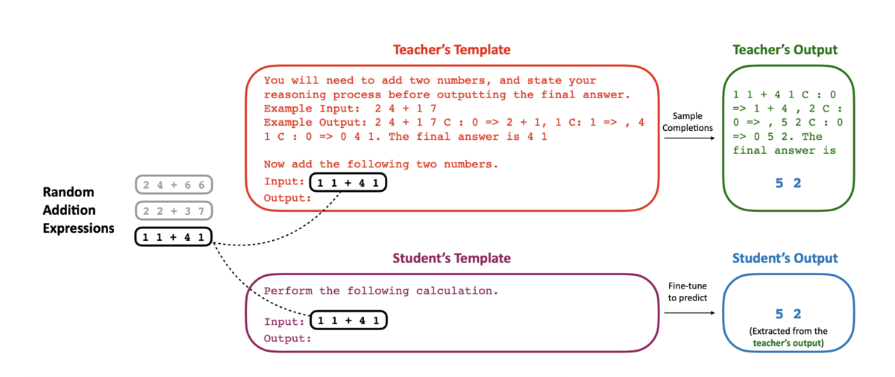

## LLM types & concepts

### Closed vs Open-weight vs Open-source vs Fully Open-source models

#### Closed models
Closed models are proprietary machine learning models developed and maintained by organizations that do not disclose their architecture, training data, or weights to the public. These models are typically accessed through APIs or licensed software, allowing users to leverage their capabilities without direct access to the underlying code or data. Examples of closed models include OpenAI's GPT-3 and GPT-4, as well as other commercial AI services provided by companies like Google and Microsoft.

#### Open-weight models
Open-weight models are pre-trained machine learning models whose architecture and learned parameters (weights) are made publicly available. This allows researchers and developers to use, modify, and fine-tune these models for various applications without needing to train them from scratch. Examples of open-weight models include GPT-2, BERT, and other models released by organizations like HuggingFace and EleutherAI.

#### Open-source frameworks/models
Models and tools whose source code is publicly available for anyone to use, modify, and distribute. This promotes collaboration, transparency, and innovation within the AI community. Examples of open-source AI frameworks include TensorFlow, PyTorch, and HuggingFace Transformers.

#### Fully Open-source models
Open-source models are machine learning models whose source code, architecture, and their training data are made publicly available. This transparency allows researchers and developers to study, modify, and improve upon the models. Open-source models promote collaboration within the AI community and facilitate innovation by enabling others to build on existing work.

- [🔗Apertus project](https://www.swiss-ai.org/apertus) | [🔗chat](https://publicai.co/)
- [🔗HF card](https://huggingface.co/collections/swiss-ai/apertus-llm-68b699e65415c231ace3b059) | [🔗HF notebook](https://huggingface.co/swiss-ai/Apertus-8B-2509)
- [📖Tech report](https://github.com/swiss-ai/apertus-tech-report/raw/main/Apertus_Tech_Report.pdf)
- [🔗Training data reconstruction script](https://github.com/swiss-ai/pretrain-data) | [🧪sample gutemberg data extraction](./apertus-data.ipynb)


#### Popular models

| **LLM**         | **Developer**      | **Multimodal?**\* | **Reasoning?**\** | **Access**                   |
|-----------------|-------------------|-----------------|----------------|------------------------------|
| GPT-5           | OpenAI            | Yes             | Yes            | API, Chatbot                 |
| GPT-4o          | OpenAI            | Yes             | No             | API, Chatbot                 |
| o3 / o3-mini    | OpenAI            | No              | Yes            | API                          |
| gpt-oss         | OpenAI            | No              | Yes            | Open                         |
| Gemini          | Google            | Yes             | No             | API, Chatbot                 |
| Gemma           | Google            | No              | No             | Open                         |
| Llama           | Meta              | Yes             | No             | Open, Chatbot                         |
| R1              | DeepSeek          | No              | Yes            | Open, API, Chatbot           |
| V3.1            | DeepSeek          | No              | Yes            | Open, API, Chatbot           |
| Claude          | Anthropic         | Yes             | Yes            | API, Chatbot                 |
| Command         | Cohere            | No              | Yes            | API                          |
| Nova            | Amazon            | Yes             | No             | API                          |
| Magistral       | Mistral           | No              | Yes            | API, Chatbot, Open    |
| Qwen            | Alibaba Cloud     | No              | Yes            | Open, API, Chatbot           |
| GLM-4.6         | Z.ai              | No              | Yes            | Open, API, Chatbot           |
| Kimi K2         | Moonshot AI       | No              | Yes            | Open, API, Chatbot           |
| Phi-4           | Microsoft         | No              | Yes | Open                  |
| Grok            | xAI               | Yes             | Yes            | API, Chatbot                 |


\* Multimodal models vs Unimodal models:
**Multimodal models** are designed to process and integrate information from multiple types of data, such as text, images, audio, and video. These models can understand and generate content that spans different modalities, enabling more complex interactions and applications.
**Unimodal models**, on the other hand, are specialized to handle a single type of data, such as text-only or image-only models. While they can excel in their specific domain, they may lack the ability to integrate information across different modalities.
[🧪multi-modal chat](./multi-modal.ipynb)

\*Reasoning vs Not Reasoning Models
**Reasoning-augmented models** are designed to perform complex reasoning tasks by incorporating explicit reasoning mechanisms, such as symbolic reasoning or structured knowledge representations. These models aim to improve performance on tasks that require deep understanding and manipulation of information.
**Not reasoning models**, on the other hand, rely primarily on pattern recognition and statistical correlations in the training data. While they can achieve impressive results on many tasks, they may struggle with tasks that require true understanding or logical reasoning.
[🧪thinking chat](./reasoning.ipynb)

> **Interface != model**
An interface is the means by which users interact with a machine learning model, while the model itself is the underlying algorithm that processes data and generates predictions or outputs. The interface can take various forms, such as a graphical user interface (**GUI**), an application programming interface (**API**), or a command-line interface (**CLI**). It serves as a bridge between the user and the model, allowing users to input data, configure settings, and receive results without needing to understand the complexities of the model's inner workings.
An interface can filter (i.e. preprocess, show/hidden reasoning), modify (i.e. postprocess, output), or enhance (i.e. adding tools like search capability) the interactions with the model, but it does not change the fundamental behavior or capabilities of the model itself.

#### Local models
Local models are machine learning models that can be run and utilized on a user's local machine or private server, rather than relying on cloud-based services. This allows for greater control over data privacy, security, and customization. Local models can be particularly useful for applications that require sensitive data handling or offline functionality.

- [HF](https://huggingface.co/docs/transformers/index)
- [Ollama](https://ollama.com/)
- [LocalAI](https://localai.io/)
- [LM Studio](https://lmstudio.ai/)
- [LLama.cpp](https://github.com/ggerganov/llama.cpp)
- [vLLM](https://github.com/vllm-project/vllm)
- [SGLang](https://github.com/sgl-project/sglang)

---

### LLM architectures/categories

#### Base and Instruct models (recap)
`Base` (or `foundation`) models are pre-trained language models that serve as the foundation for various downstream tasks. They are trained on large corpora of text data and can generate coherent text based on the input they receive. `Instruct` models, on the other hand, are fine-tuned versions of base models that are trained on specific tasks or  specifically designed to follow user instructions more effectively (involving techniques like Reinforcement Learning with Human Feedback (RLHF) to better align the model's responses with user intentions)

---

#### Quantization
Quantization is the process of reducing the precision of the numbers used to represent a model's parameters, typically from 32-bit floating point to lower bit-width formats like 16-bit or 8-bit. 
This can significantly:
  - reduce the model size
  - reduce memory footprint
  - speed up inference times

with minimal impact on model performance


- sample precision reduction

    | Precision Level | Pi (`π`) | Time |
    |------------------|----------|------|
    | **full** | `3.1415926535897932384626433832795` | `2025-11-01T14:37:28.456789` |
    | **medium** | `3.1416` | `2025-11-01T14:37:28` |
    | **small** | `3.14` | `14:37:28` |
    | **minimal** | `3.125` | `14:37` |

- sign, exponent, mantissa representation

    | Format | Sign | Exponent | Mantissa |
    |--------|------|----------|----------|
    | **FP32** | 1 | 11111111 | 11111111111111111111111 |
    | **FP16** | 1 | 11111 | 1111111111 |
    | **INT8** | N/A | N/A | 11111111 |


    | Format | Sign | Exponent | Mantissa |
    |--------|------|----------|----------|
    | **FP32** | 1 bit | 8 bits | 23 bits |
    | **FP16** | 1 bit | 5 bits | 10 bits |
    | **INT8** | N/A | N/A | 8 bits (integer) |

In a model quantization can be applied to:
- **Weights**: reducing the precision of the model's learned parameters.
- **Activations**: reducing the precision of the intermediate outputs during model inference.

memory saving for a `7B` model:

- FP32: 7B x 4 bytes = 28GB
- FP16: 7B x 2 bytes = 14GB
- INT8: 7B x 1 byte = 7GB
- INT4: 7B x 0.5 bytes = 3.5GB


[🧪Quantization](./quantization.ipynb)
[🔗Floating point converter](https://www.h-schmidt.net/FloatConverter/IEEE754.html)

--- 

#### Distillation
In Large Language Model (LLM) distillation, the primary goal is to transfer the **performance and "knowledge"** of a large, complex "teacher" model to a much smaller, faster, and more efficient "student" model.

This transfer isn't just about getting the right answer; it's about teaching the student model to **mimic the teacher's "thought process" and underlying capabilities**.

Here are the typical tasks and abilities transferred during this process:

#### 1. General Task Performance

This is the most straightforward transfer. The student model is trained to perform specific, well-defined Natural Language Processing (NLP) tasks at a level of quality similar to the teacher.

Common tasks include:
* **Text Summarization:** Condensing long documents.
* **Machine Translation:** Translating text from one language to another.
* **Text Classification:** Categorizing text (e.g., sentiment analysis, topic identification).
* **Question Answering:** Providing direct answers to questions based on a given context.
* **Conversational AI:** Powering chatbots that can maintain coherent and helpful dialogues.

#### 2. Complex Reasoning Abilities

This is a more advanced and powerful form of distillation. Instead of just training the student on the final answer (e.g., "The answer is 42"), the teacher provides its **step-by-step reasoning** or "chain of thought."

* **How it works:** The teacher model generates a detailed rationale explaining *how* it arrived at an answer. The student model is then trained to reproduce this entire reasoning process.
* **Ability Transferred:** The student learns the teacher's **problem-solving logic** and **reasoning patterns**. This is crucial for tasks involving math, logic puzzles, and complex instruction-following.

#### 3. Alignment and Preference

This involves transferring the teacher's safety training and adherence to human preferences (as learned through methods like RLHF - Reinforcement Learning from Human Feedback).

* **How it works:** The teacher model, which has already been aligned to be helpful, honest, and harmless, generates responses. The student learns to emulate this **aligned behavior**.
* **Ability Transferred:** The student inherits the teacher's **safety alignment, conversational style, and understanding of nuanced human values** (e.g., knowing *why* one answer is more helpful or appropriate than another).

#### 4. Internal Knowledge Representation

This is the deepest form of distillation. The student model is trained to not only match the teacher's final output but also to **mimic the teacher's internal "state"** or calculations at intermediate steps.

* **How it works:** The training process aligns the student's hidden layers (the internal "brain" of the network) with the teacher's hidden layers.
* **Ability Transferred:** The student learns the teacher's fundamental **feature-extraction techniques** and hierarchical understanding of language, rather than just surface-level patterns.



[🧪Distillation](./distillation.ipynb)

--- 

#### MoE (Mixture of Experts)

**Mixture of Experts (MoE)** is a neural network architecture that consists of multiple specialized sub-networks, or "experts," each trained to handle specific types of input data or tasks. During inference, a `gating` (or `routing`) mechanism determines which experts to activate based on the input, allowing the model to leverage the most relevant expertise for a given task. This approach can improve performance and efficiency by enabling the model to focus on specialized knowledge without requiring all experts to be active simultaneously.

###### What Experts ARE

**Experts are specialized neural network layers** within the model that process information differently:

- **Specialized sub-networks**: Each expert is a complete neural network layer (typically a feed-forward network) with its own parameters
- **Task-specific learners**: During training, experts naturally specialize in different patterns, domains, or types of reasoning
- **Conditionally activated**: Only a subset of experts (typically 1-2 out of 8-16) are activated for each input token
- **Resource efficient**: By activating only relevant experts, MoE models achieve higher capacity without proportional computational cost

**Example 1: Math Question**

*Input*: "What is the derivative of x² + 3x?"

```text
┌─────────────────────────────────────┐
│   Gating Network (Router)           │
│   Analyzes: "derivative", "x²"      │
└─────────────────────────────────────┘
           ↓
    Routes to Expert #3 & #7
           ↓
┌──────────────────┐  ┌──────────────────┐
│ Expert #3        │  │ Expert #7        │
│ (Calculus)       │  │ (Algebra)        │
│ - Recognizes     │  │ - Handles        │
│   derivative     │  │   polynomial     │
│   rules          │  │   expressions    │
└──────────────────┘  └──────────────────┘
           ↓
    "The derivative is 2x + 3"
```

**Other experts remain inactive**:
- Expert #1 (History/Culture) - not needed
- Expert #2 (Code Generation) - not needed
- Expert #4 (Translation) - not needed
- Expert #5 (Creative Writing) - not needed
- Expert #6 (Legal/Medical) - not needed
- Expert #8 (Common Sense) - not needed

**Example 2: Summarization Task**

*Input*: "Summarize this 500-word article about climate change..."

```text
┌─────────────────────────────────────┐
│   Gating Network (Router)           │
│   Analyzes: "summarize", "article"  │
└─────────────────────────────────────┘
           ↓
    Routes to Expert #2 & #5
           ↓
┌──────────────────┐  ┌──────────────────┐
│ Expert #2        │  │ Expert #5        │
│ (Text Compress.) │  │ (Scientific Lang)│
│ - Identifies     │  │ - Understands    │
│   key points     │  │   climate        │
│ - Condenses info │  │   terminology    │
└──────────────────┘  └──────────────────┘
           ↓
    "Climate change refers to..."
```

##### What Experts are NOT

❌ **Not separate complete models**: Experts are layers within a single model, not independent models running in parallel

```text
WRONG CONCEPT:
┌─────────┐  ┌─────────┐  ┌─────────┐
│ Model A │  │ Model B │  │ Model C │  ← NOT separate models
│(7B full)│  │(7B full)│  │(7B full)│
└─────────┘  └─────────┘  └─────────┘

CORRECT CONCEPT:
┌──────────────────────────────────────┐
│     Single 8x7B MoE Model (56B)      │
│  ┌────┐ ┌────┐ ┌────┐ ... ┌────┐     │
│  │ E1 │ │ E2 │ │ E3 │ ... │ E8 │     │  ← Experts are layers
│  └────┘ └────┘ └────┘     └────┘     │
│  (Only 2 experts activated per token)│
└──────────────────────────────────────┘
```

❌ **Not manually programmed specialists**: Experts learn their specialization automatically during training, not through explicit programming

```text
You CANNOT manually assign:
- Expert #1 = "Handle only math questions"
- Expert #2 = "Handle only language translation"

Instead, experts naturally specialize based on training data patterns
```

❌ **Not human-understandable domains**: Expert specializations emerge automatically and may not correspond to human categories

```text
Experts might specialize in:
- Expert #3: "Short sentences with technical terms"
- Expert #5: "Long context with reasoning chains"
- Expert #7: "Pattern matching in structured data"

NOT necessarily:
- Expert #1: "Mathematics"
- Expert #2: "History"
- Expert #3: "Science"
```

❌ **Not always active**: Unlike dense models where all parameters process every token, MoE experts are selectively activated

```text
Dense Model (7B):
Input → [All 7B params active] → Output
Cost: 7B FLOPs* per token

MoE Model (8x7B = 56B total):
Input → [Router selects 2 experts = ~14B params] → Output
Cost: ~14B FLOPs per token (not 56B!)

* FLOPs = Floating Point Operations, a measure of computational cost 
```


[🧪Mixture of Experts](./moe.ipynb)
[🔗HF blog](https://huggingface.co/blog/moe)

---

### Common LLM Model Naming Conventions

| **Component** | **Description** | **Example Pattern** | **Real Examples** |
|---------------|-----------------|---------------------|-------------------|
| **Base Name** | The model family or series | `Llama`, `Qwen`, `Mistral` | `Llama-3`, `Qwen2.5`, `Mistral-7B` |
| **Version** | Major release iteration | `-2`, `-3`, `-4` | `Llama-3.1`, `Qwen2.5`, `Mistral-v0.3` |
| **Size (Parameters)** | Number of parameters in billions (B) | `-7B`, `-13B`, `-70B` | `Llama-3-8B`, `Qwen2.5-72B`, `Mistral-7B` |
| **Instruction Tuning** | Model fine-tuned to follow instructions | `-Instruct`, `-Chat`, `-IT` | `Llama-3-8B-Instruct`, `Qwen2.5-7B-Instruct` |
| **Quantization** | Reduced precision format | `-Q4_K_M`, `-GGUF`, `-AWQ`, `-GPTQ` | `Llama-3-8B-Q4_K_M.gguf`, `Qwen2.5-7B-AWQ` |
| **Context Length** | Maximum token context window | `-32K`, `-128K`, `-1M` | `Qwen2.5-7B-Instruct-128K`, `Llama-3.1-8B-1M` |
| **MoE Architecture** | Mixture of Experts with activated params | `-MoE`, `-8x7B`, `-16x7B` | `Qwen2.5-MoE-A2.7B`, `Mixtral-8x7B` |
| **Distillation** | Smaller model trained from larger one | `-Distilled`, `-Mini`, `-Lite` | `Llama-3-8B-Distilled`, `Qwen2.5-3B` |
| **Specialization** | Domain-specific fine-tuning | `-Code`, `-Math`, `-Medical` | `Qwen2.5-Coder-7B`, `Llama-3-MedTune` |
| **Fine-tuning Method** | Specific training technique | `-LoRA`, `-PEFT`, `-DPO` | `Llama-3-8B-DPO`, `Qwen2.5-7B-LoRA` |

### Real-World Examples Breakdown

| **Model Name** | **Base** | **Version** | **Size** | **Tuning** | **Quantization** | **Special** |
|----------------|----------|-------------|----------|------------|------------------|-------------|
| `Llama-3.1-8B-Instruct` | Llama | 3.1 | 8B | Instruct | - | - |
| `Qwen2.5-72B-Instruct-GPTQ-Int4` | Qwen | 2.5 | 72B | Instruct | GPTQ-Int4 | - |
| `Mixtral-8x7B-Instruct-v0.1` | Mixtral | v0.1 | 8x7B (MoE) | Instruct | - | MoE |
| `Qwen2.5-Coder-7B-Instruct` | Qwen | 2.5 | 7B | Instruct | - | Code specialist |
| `Llama-3-70B-Q4_K_M.gguf` | Llama | 3 | 70B | - | Q4_K_M (GGUF) | - |
| `Qwen2.5-MoE-A2.7B-Instruct` | Qwen | 2.5 | MoE (2.7B active) | Instruct | - | MoE |
| `Mistral-7B-v0.3-AWQ` | Mistral | v0.3 | 7B | - | AWQ | - |
| `Llama-3.1-8B-Instruct-128K` | Llama | 3.1 | 8B | Instruct | - | 128K context |

### Quantization Format Suffixes

| **Format** | **Description** | **Typical Use** |
|------------|-----------------|-----------------|
| `GGUF` | GPT-Generated Unified Format (llama.cpp) | CPU/GPU inference with Ollama, LM Studio, aggressive quantization |
| `Q4_K_M` [M,S] | 4-bit quantization, K-means, Medium | Balanced quality/size |
| `Q8_0` [0,1,...] | 8-bit quantization | Higher quality, larger size |
| `AWQ` | Activation-aware Weight Quantization (Post-training) | GPU inference (vLLM, TGI) |
| `GPTQ` | Gradient Post-Training Quantization | GPU inference |

### MoE Naming Patterns

| **Pattern** | **Meaning** | **Example** |
|-------------|-------------|-------------|
| `8x7B` | 8 experts, each 7B params | `Mixtral-8x7B` |
| `16x7B` | 16 experts, each 7B params | `Mixtral-16x7B` (hypothetical) |
| `MoE-A2.7B` | MoE with 2.7B activated params | `Qwen2.5-MoE-A2.7B` |
| `57B-A14B` | Total 57B params, 14B activated | `Qwen2.5-57B-A14B-Instruct` |

---

## LLM performance concepts

### Neural scaling law
The neural scaling law describes how the performance of neural networks changes with the size of the model (number of parameters) and the amount of training data. It suggests that larger models tend to perform better, but also require more data and computational resources to train effectively.


- Performance speed increase over time
 

[🧪epoch-ai models database](.ai-models.ipynb)

### Benchmarking
Benchmarking involves evaluating and comparing the performance of different models or algorithms on standardized datasets and tasks. This helps researchers and practitioners understand the strengths and weaknesses of various approaches and make informed decisions about model selection and deployment.

- [LMArena leaderboard](https://lmarena.ai/leaderboard)
- [llm-stats](https://llm-stats.com/)
- [HF Embeddings](https://huggingface.co/spaces/mteb/leaderboard)

#### Common LLM Benchmarks

- **MMLU** / **MMLU-Pro**
The MMLU (Massive Multitask Language Understanding) testing knowledge across 57 diverse subjects including STEM, humanities, social sciences, and professional domains. 4 multiple-choice answers per question (10 choices for MMLU-Pro).
[paper](https://arxiv.org/pdf/2009.03300)
[dataset](https://huggingface.co/datasets/cais/mmlu)
[🧪MMLU live test](.mmlu.ipynb)

- **GPQA**
GPQA (General-Purpose Question Answering) is a challenging dataset of 448 multiple-choice questions written by domain experts in biology, physics, and chemistry. Questions are Google-proof and extremely difficult, with PhD experts reaching 65% accuracy.
[paper](https://arxiv.org/abs/2311.12022)
[dataset](https://huggingface.co/datasets/Idavidrein/gpqa)

- **GSM8K**
GSM8K (Grade School Math 8K) is a benchmark dataset specifically focused on evaluating the mathematical reasoning capabilities of language models. It consists of 8,000 grade school-level math word problems that require multi-step reasoning to solve. The dataset is used to test how well models can understand and manipulate numerical information in a natural language context.
[paper](https://arxiv.org/abs/2110.1416877)
[dataset](https://huggingface.co/datasets/openai/gsm8k)

- **DROP**
DROP (Discrete Reasoning Over Paragraphs) is a benchmark dataset designed to evaluate the ability of language models to perform complex reasoning tasks that require understanding and manipulating information from text. It includes questions that involve arithmetic, counting, and logical reasoning based on passages of text.
[paper](https://arxiv.org/abs/1903.00161)
[dataset](https://huggingface.co/datasets/ucinlp/drop)

#### Tools
- [Lighteval](https://github.com/huggingface/lighteval) - toolkit for evaluating LLMs across multiple backends
- [🧪eval leaderboard|truthfulqa](./eval.ipynb)

#### Data leakage

**Benchmark contamination** (or **data leakage**) is a well-known problem in the AI research community that occurs when models are trained on data that includes (or is very similar to) test questions from public benchmarks. This means the model might be "memorizing" answers rather than truly understanding the concepts.

##### How Contamination Happens

1. **Direct Contamination**: Training data explicitly includes benchmark questions
2. **Indirect Contamination**: Training data includes paraphrased versions or discussions of benchmark questions (e.g., from forums, educational websites)
3. **Web Scraping**: Many LLMs are trained on massive web scrapes that may inadvertently include benchmark datasets shared online

##### Pros of Common Benchmarking

| **Advantage** | **Description** |
|---------------|-----------------|
| **Standardization** | Provides a common language for comparing different models |
| **Reproducibility** | Public datasets allow researchers to verify results |
| **Progress Tracking** | Shows how the field is advancing over time (see neural scaling law) |
| **Accessibility** | Anyone can evaluate their models without expensive infrastructure |
| **Transparency** | Open benchmarks promote accountability in AI development |

##### Cons of Common Benchmarking

| **Problem** | **Description** | **Impact** |
|-------------|-----------------|------------|
| **Data Contamination** | Models trained on benchmark data | Inflated scores that don't reflect true capability |
| **Overfitting to Benchmarks** | Models optimized specifically for benchmark performance | Poor generalization to real-world tasks |
| **Benchmark Saturation** | Models achieving near-perfect scores | Benchmark becomes less useful for distinguishing capabilities |
| **Gaming the System** | Companies may cherry-pick favorable benchmarks | Misleading comparisons between models |
| **Limited Scope** | Benchmarks may not capture all important capabilities | Models excel at tests but fail at practical tasks |

##### Current Solutions & Best Practices

###### 1. Private Test Sets

Some organizations maintain private, never-disclosed test sets:

- **GPQA** uses "Google-proof" questions
- Regular rotation of test questions
- Hold-out sets never released publicly

###### 2. Dynamic Benchmarks

- Continuously updated with new questions
- [LMArena](https://lmarena.ai/leaderboard) uses human preference voting on new prompts
- Reduces memorization risk

###### 3. Contamination Detection

Research organizations now:

- Check training data for benchmark overlap
- Report contamination analysis in model papers
- Use techniques like n-gram matching to detect leakage

###### 4. Multi-Benchmark Evaluation

Instead of relying on a single benchmark, evaluate across multiple datasets:

```text
Model Performance Profile:
┌────────────────────────────────────┐
│ MMLU:      92% ✓ (Knowledge)       │
│ GSM8K:     78% ⚠ (Math Reasoning)  │
│ DROP:      65% ⚠ (Reading Comp.)   │
│ GPQA:      45% ✗ (Expert Questions)│
│ HumanEval: 71% ✓ (Code Gen.)       │
└────────────────────────────────────┘
Conclusion: Strong on knowledge,
weaker on complex reasoning
```

###### 5. Real-World Task Evaluation

Increasingly, researchers emphasize:

- **Human evaluation** (like LMArena's chatbot arena)
- **Domain-specific tests** (medical diagnosis, legal reasoning)
- **Adversarial testing** (can the model be tricked?)

##### The Future: Better Evaluation Methods

The AI community is moving toward:

1. **Evaluation as a Service**: Proprietary evaluation platforms where models are tested without revealing test data
2. **Capability-Based Assessment**: Testing specific reasoning abilities rather than memorization
3. **Red Teaming**: Adversarial testing to find model weaknesses
4. **Longitudinal Studies**: Tracking model performance on tasks over time as data evolves

##### Practical Takeaway

When evaluating models, look for:

- ✅ Multiple benchmark scores (not just one)
- ✅ Contamination analysis reports
- ✅ Human evaluation results (like [LMArena](https://lmarena.ai/leaderboard))
- ✅ Real-world application performance
- ❌ Single benchmark scores in isolation
- ❌ Unreported training data sources

The best approach is to treat benchmarks as **indicators** rather than **definitive proof** of model capability, and always validate performance on your specific use case.
