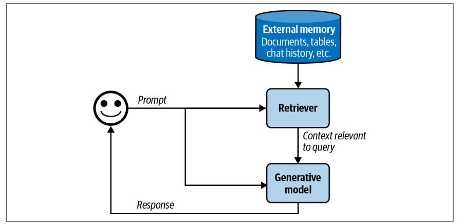
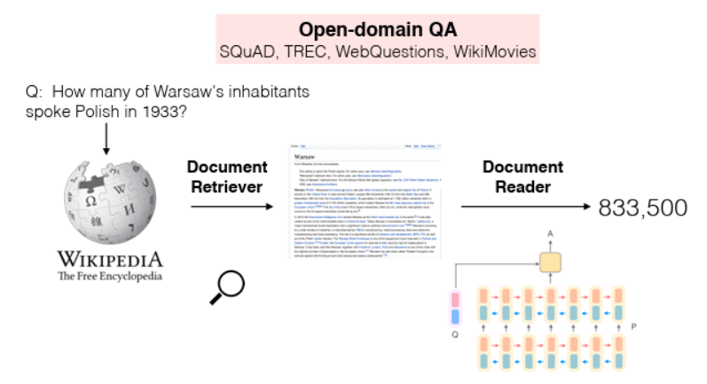
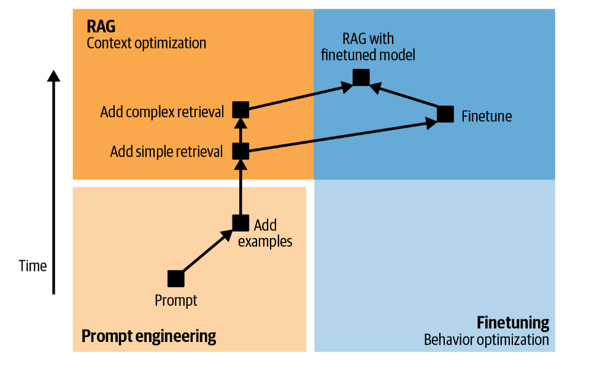
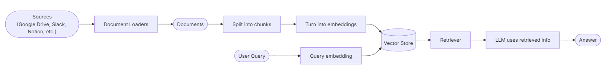

## RAG (Retrieval-Augmented Generation)

RAG is a technique that combines retrieval of relevant information from external sources with the generative capabilities of LLMs. <br/>
`retrieve-then-generate` pattern: search for relevant documents based on a user query, then use those documents to inform and enhance the LLM's response.

### Why LLMs Benefit from RAG?

<details>
<summary>What RAG does</summary>

Retrieval-Augmented Generation enhances LLMs by incorporating an information retrieval system that provides **grounding** data. <br/>
Grounding helps LLMs generate more accurate, relevant, and context-aware responses by referencing up-to-date and domain-specific information.<br/>

Rather than relying solely on `training data`, RAG enables models to access `external knowledge` sources dynamically, improving accuracy and relevance.



</details>

<details>
<summary>Core use cases</summary>

LLMs have revolutionized artificial intelligence, but they face inherent limitations that can be addressed through RAG. Here are some of the most important use cases for vector databases and RAG in enhancing LLM capabilities:

- **Overcoming Knowledge Cutoff Limitations**

    Every LLM has a knowledge cutoff date beyond which it cannot reliably answer questions. For models trained on data ending 6 months ago, any information about events, developments, or changes after that date remains unknown. Vector databases solve this by storing up-to-date information that can be retrieved dynamically.

    This capability is particularly valuable for:
    - _News and current events_: Providing users with information about recent developments
    - _Regulatory changes_: Keeping legal and compliance systems current with new laws and policies
    - _Market data_: Offering real-time or near-real-time financial information
    - _Scientific research_: Accessing the latest studies and findings in rapidly evolving fields

    [🐍LLM cutoff](./llm-cutoff.ipynb)

- **Integrating Private and Proprietary Knowledge**

    LLMs are trained on publicly available data and cannot inherently access company-specific information, internal documents, or proprietary knowledge bases. This limitation makes them inadequate for enterprise applications without augmentation.

    RAG enable organizations to:
    - Store _internal documentation_, policies, and procedures
    - Index _company-specific knowledge_ bases and _wikis_
    - Maintain _**proprietary** research_ and development information
    - Preserve institutional knowledge and best practices
    - Create _context-aware_ responses based on organizational data

    For example, an HR chatbot can answer questions like "How much annual leave do I have?" by retrieving both company policy documents and the employee's individual leave records from the vector database.

- **Enabling Domain-Specific Customization**

    Organizations often need LLMs to understand specialized terminology, industry-specific knowledge, or domain expertise that wasn't sufficiently covered in training data. Rather than fine-tuning models (which is expensive and time-consuming), RAG provides a flexible alternative.

    RAG facilitate:
    - Storage of domain-specific _terminology_ and definitions
    - Indexing of specialized technical documentation
    - Access to industry-specific _best practices_ and standards
    - Integration of expert knowledge and _case studies_
    - Adaptation to niche markets and specialized fields

    Healthcare systems can leverage medical literature, legal applications can access case law databases, and manufacturing systems can reference technical specifications—all without retraining the base model.    

- **Effectively Managing Long-Term Memory**

    While modern LLMs boast impressive `context windows` (> 1M tokens), there are practical limitations. Context windows consume significant computational resources, increase latency, and can actually decrease retrieval accuracy when relevant information is buried in the middle of massive contexts.

    RAG provide a more efficient solution by:
    - Storing conversational history and user interactions externally
    - Retrieving only relevant past context when needed
    - Reducing the amount of information loaded into each prompt
    - Enabling semantic search across historical interactions
    - Supporting scalable, cost-effective memory management

    This approach allows systems to maintain coherent, personalized experiences across multiple sessions without overwhelming the model's context window.

    \* `Anthropic` suggested that for Claude models, if “your knowledge base is smaller than 200,000 tokens (about 500 pages of material), you can just include the entire knowledge base in the prompt that
you give the model, with no need for RAG or similar methods”
([🔗Anthropic, 2024](https://www.anthropic.com/engineering/contextual-retrieval)). However, for larger knowledge bases or more complex applications, RAG remains essential.<br/>

    [📘Lost in the middle problem](https://arxiv.org/pdf/2307.03172)

- **Enabling Dynamic Few-Shot Learning**

    Few-shot prompting—providing examples to guide LLM behavior—becomes more powerful when examples are selected dynamically based on similarity to the current query. RAG enable this by storing/retrieving the most relevant examples from a large corpus.

    This capability supports:
    - Context-appropriate response styling
    - Task-specific formatting and structure
    - Domain-relevant reasoning patterns
    - Adaptive prompt engineering based on query type

    Rather than including fixed examples in every prompt, the system retrieves examples most similar to the current task, improving relevance while conserving context window space.

- **Reducing Hallucinations and Improving Accuracy**

    One of the most persistent challenges with LLMs is their tendency to generate `plausible-sounding` but `incorrect`, not factual information — a phenomenon called **hallucination**.       
    RAG significantly mitigates this by grounding responses in retrieved facts.

    RAG improves reliability by:
    - Providing authoritative `sources` for factual claims
    - Enabling `citation` of specific documents and sources
    - Reducing reliance on potentially _incorrect_ training data
    - Allowing verification of generated content against source material
    - Building trust through transparent information sources

    This is particularly crucial in high-stakes domains like healthcare, legal services, and financial advice, where accuracy is paramount.

- **Cost-Effective Model Enhancement**

    Fine-tuning or retraining foundation models for specific use cases is computationally expensive and requires significant expertise. <br/>
    It also creates ongoing maintenance challenges as information updates. <br/>
    RAG provides a more economical alternative.

    Advantages include:
    - No need for expensive model retraining => _the model remains **unchanged**_
    - Easy updates by adding new documents
    - Reuse of base models across multiple applications (maybe on different industries/domains with different domain-specific knowledge bases)
    - Lower infrastructure and computational requirements
    - Faster deployment and iteration cycles

    Organizations can leverage powerful foundation models (even `closed-source`) while customizing behavior through their knowledge base, dramatically reducing total cost of ownership.
</details>

<details>
<summary>retrieve-then-generate</summary>

1. **User Query**: A user submits a query or prompt to the system.
2. **Retrieval**: The system uses a retrieval mechanism (like a vector database or search engine) to find documents or data relevant to the query.
3. **Contextualization**: The retrieved documents are processed and formatted to provide context for the LLM.
4. **Generation**: The LLM generates a response based on both the original query and the additional context from the retrieved documents.
5. **Response Delivery**: The generated response is returned to the user, often with citations or references to the source documents.

[📘 Reading Wikipedia to Answer Open-Domain Questions](https://arxiv.org/pdf/1704.00051)



<sub>In this work, the system first
retrieves five Wikipedia pages most relevant to a question, then a model
 uses the information from these pages to generate an answer</sub>

[🐍Demo with tools](./retrieve-then-generate.ipynb)

[🔗LangChain](https://docs.langchain.com/oss/python/langchain/overview)
</details>

<details>
<summary>RAG vs Fine-tuning</summary>

> **Core Difference**: RAG retrieves external knowledge at query time to augment responses, while Fine-Tuning modifies the model's internal parameters through additional training on specialized data.

| **Aspect** | **RAG (Retrieval-Augmented Generation)** | **Fine-Tuning** |
|------------|------------------------------------------|-----------------|
| **Core Mechanism** | Retrieves external knowledge at query time and injects it into the prompt | Retrains model on specialized data to modify internal parameters |
| **Model Modification** | Model remains unchanged | Model weights and parameters are adjusted |
| **Knowledge Location** | External (databases, documents) | Internal (embedded in model parameters) |
| **Knowledge Updates** | Update knowledge base independently, without retraining | Requires full retraining cycle to incorporate new information |
| **Best For Knowledge Type** | Dynamic, frequently changing information (news, regulations, product catalogs) | Static, stable domain knowledge (established procedures, terminology) |
| **Factual Accuracy** | High—grounded in retrieved sources, reduces hallucinations significantly | Moderate—can hallucinate within trained domain, can mix model pre-trained knowledge with fine-tuned data, no source verification |
| **Source Attribution** | Excellent—can cite specific documents and passages | None—cannot trace responses to training sources |
| **Transparency** | High—can inspect retrieved documents and audit retrieval process | Low—knowledge distributed opaquely across parameters |
| **Behavioral Customization** | Limited—cannot fundamentally change style, tone, or output format | Excellent—can deeply customize behavior, writing style, and reasoning patterns |
| **Domain Specialization Depth** | Moderate—provides information but lacks deep domain expertise | Deep—learns implicit knowledge, jargon, and professional reasoning patterns |
| **Implementation Cost** | Low to moderate—no model training required, but needs vector database infrastructure | High—requires powerful GPUs, extensive training time, and expertise |
| **Data Requirements** | Well-organized, searchable documents and knowledge bases | Large, high-quality labeled datasets (thousands to tens of thousands of examples) |
| **Inference Speed** | Slower—adds 100-500ms to seconds latency for retrieval step | Faster—no retrieval overhead, self-contained responses |
| **Context Window Usage** | High—retrieved documents consume significant context space | Low—domain knowledge in parameters frees up context for instructions |
| **Data Security & Privacy** | Excellent—data stays in secured databases with granular access controls, easy compliance | Challenging—training data embedded in weights, harder to ensure deletion or compliance |
| **Multi-Domain Scalability** | Excellent—one model serves multiple domains by switching knowledge bases | Poor—requires separate model for each domain, expensive to maintain |
| **Maintenance Burden** | Continuous but light—ongoing knowledge base curation and monitoring | Periodic but intensive—infrequent retraining cycles requiring significant resources |
| **Risk of Capability Loss** | None—preserves all original model capabilities | Risk of `catastrophic forgetting` — may lose general knowledge during specialization |
| **Setup Complexity** | Moderate—requires vector database, embedding pipeline, retrieval optimization | High—needs training infrastructure, data preparation, hyperparameter tuning |
| **Debugging & Troubleshooting** | Easier—can examine retrieved documents and assess retrieval quality | Harder—errors embedded in parameters, requires comprehensive testing |
| **Cost Over Time** | Lower upfront, moderate ongoing (database hosting, retrieval infrastructure) | High upfront (training), lower ongoing (hosting only, but inference cost per query) |
| **Regulatory Compliance** | Easier—data governance, GDPR compliance, right to deletion | Harder—data embedded in model, difficult to prove complete removal |
| **Best Use Cases** | • Current events and news<br>• Proprietary company knowledge<br>• Multi-tenant applications<br>• Frequently updated information<br>• Document Q&A systems<br>• Compliance-sensitive domains | • Brand voice consistency<br>• Deep domain specialization<br>• Custom output formatting<br>• Behavior modification<br>• Stable professional domains<br>• Latency-critical applications |

- Choose RAG if you need:
    - ✓ Access to current, frequently changing information
    - ✓ Source attribution and fact verification
    - ✓ Strong data privacy and compliance controls
    - ✓ Multi-domain or multi-tenant scalability
    - ✓ Quick deployment with limited resources
    - ✓ To avoid model retraining overhead

- Choose Fine-Tuning if you need:
    - ✓ Deep domain expertise and implicit knowledge
    - ✓ Consistent brand voice or writing style
    - ✓ Custom output formats or structures
    - ✓ Behavioral modifications
    - ✓ Minimal inference latency
    - ✓ Stable domain with infrequent updates

- Consider Hybrid (RAG + Fine-Tuning) if you need:
    - ✓ Both domain expertise AND current information
    - ✓ Professional reasoning WITH up-to-date facts
    - ✓ Specialized behavior PLUS verifiable sources
    - ✓ The best of both approaches

    

[📋 Fine-tuning vs RAG in less popular knowledge](https://arxiv.org/pdf/2403.01432)
</details>

<details>
<summary>RAG Architecture Overview</summary>

RAG systems typically consist of the following components:

1. **Embedding Model**: A model that converts text (or other data types) into `vector representations` (embeddings).
2. **Document Store**: A `vector database` that stores documents as high-dimensional vectors, enabling efficient similarity search and retrieval.
3. **Retriever**: A component that takes a user query, converts it into an embedding, and retrieves the most `relevant documents` from the vector database.
4. **LLM**: A large language model that generates responses based on the retrieved documents and the `original query`.
5. **Orchestration Layer**: Manages the flow of data between components, ensuring seamless integration and response generation.


</details>

---

### RAG evolutions

The term retrieval-augmented generation was coined in _Retrieval-Augmented Gen‐
eration for Knowledge-Intensive NLP Tasks_ (Lewis et al., 2020). The [📋 paper](https://arxiv.org/pdf/2005.11401) proposed
RAG as a solution for knowledge-intensive tasks where all the available knowledge
can’t be input into the model directly. 

<details>
<summary>Retrieval algorithms</summary>

At its core, retrieval works by ranking documents based on their relevance to a given
query. Two main approaches exist for this:

- **Terms matching** (`TF-IDF` (Term Frequency-Inverse Document Frequency), `BM25` (Best Matching 25)): simple and efficient for exact matches, but limited in semantic understanding.
    - TF-IDF: represents documents and queries as vectors based on term frequency, emphasizing unique terms. The assumption is that terms that appear frequently in a document but rarely across the corpus are more important for that document's content.
    - BM25: an advanced probabilistic model that builds on TF-IDF, considering term frequency saturation and document length normalization to improve relevance scoring.

    [🐍Term-based retrieval algorithms](./term-retrieval-algorithms.ipynb)

- **Dense retrieval** (`vector embeddings` + `ANN` (Approximate Nearest Neighbor) search): captures semantic meaning, enabling retrieval of relevant documents even with different wording.

</details>

<details>
<summary>RAG building blocks</summary>

- **Document Loaders:** Extract and load documents from various sources (PDFs, websites, databases, Google Drive, S3 buckets, Slack, etc.) into a format suitable for processing.
    [🐍 Document loaders](./rag-loaders.ipynb)
- **Text Splitters:** Break down large documents into smaller, manageable chunks that will be retrievable individually and fit within a model's context window.
    [🐍 Text splitters](./rag-text-splitters.ipynb)
- **Embedding Models:** Convert text chunks into vector representations (embeddings) that capture semantic meaning.
    [🐍 Embeddings](./rag-embeddings.ipynb)
- **Vector Databases:** Store and index embeddings for efficient similarity search and retrieval in specialized databases.
    [🐍 Vector databases (movies)](./vector-db-movies.ipynb) | [🐍 Vector databases (app)](./vector-db-app.ipynb)

    [🐍 Search ensemble](./search-ensemble.ipynb)

    [🐍 Cross-Encoder](./cross-encoder.ipynb)

- **Retriever:** Fetch relevant documents based on the similarity of embeddings to the given query.
    [🐍 Retrievers](./rag-retrievers.ipynb)
- **LLM Integration:** Combine retrieved documents with the original query to generate informed responses.



</details>


### Vector Databases

> Since embeddings are `lossy encodings`, you need an external store (like a vector database plus metadata, or any others lookup mechanism paired with vectors) to map retrieved vectors back to their original documents, functionally serving as the `decoder` for the embedding space.

[🐍 Embeddings lookup](./embeddings-lookup.ipynb)

Vector databases serve as the backbone of RAG systems.
> A vector database is a specialized database designed to `store`, `index`, and `query` high-dimensional vector representations of data. 

 They store data as high-dimensional vectors (capturing semantic meaning) and enable efficient similarity searches. When a user submits a query, it's converted into a vector and matched against stored vectors to retrieve the most relevant context, which then augments the LLM's response.


<details><summary>Relational vs Document vs Vector databases</summary>

| **Aspect** | **Relational Databases** | **Document Databases** | **Vector Databases** |
|------------|--------------------------|------------------------|----------------------|
| **Data Structure** | Tables with rows and columns | JSON-like documents with flexible schemas | High-dimensional vectors (arrays of numbers) |
| **Schema** | Fixed, predefined schema | Flexible, schema-less or dynamic schema | Schema-free (vectors + optional metadata) |
| **Query Method** | Structured Query Language (SQL) | NoSQL queries (MongoDB query language, etc.) | Similarity search (cosine similarity, Euclidean distance) |
| **Search Type** | Exact matches, joins, aggregations | Exact/fuzzy matches, document traversal | Approximate nearest neighbor (ANN) search |
| **Best For** | Structured data with relationships (transactions, inventory) | Semi-structured data with varying fields (user profiles, logs) | Semantic search, similarity matching (recommendations, embeddings) |
| **Primary Use Cases** | Financial systems, ERP, CRM | Content management, catalogs, user data | NLP tasks, image retrieval, recommendation systems, RAG applications |
| **Scalability**\* | Vertical scaling (primarily) | Horizontal scaling | Horizontal scaling with specialized indexing |
| **Performance Focus** | ACID transactions, data integrity | Flexible reads/writes, document retrieval | Fast similarity search across millions/billions of vectors |

\* Relational databases typically scale up (more CPU/RAM on one node) to keep ACID guarantees and complex joins consistent (clustering is also possible but generally more complex).<br/> Document stores are built for horizontal sharding—documents are independent, so they can be spread across many nodes. <br/>Vector databases must shard embeddings while preserving ANN index quality, so they pair horizontal scaling with specialized indexing (e.g., HNSW partitions, IVF shards) that keeps search accuracy high despite the added nodes.
</details>


<details>
<summary>How Vector Databases Work</summary>

1. **Data Ingestion**: Raw data (text, images, audio) is processed using embedding models to convert it into high-dimensional vectors.
2. **Storage**: These vectors are stored in the vector database, which is optimized for handling high-dimensional data, along with metadata (e.g., document IDs, source, titles).
3. **Indexing**: The database creates indexes to facilitate fast similarity searches. A common indexing technique is Approximate Nearest Neighbor (ANN) algorithms.
4. **Querying**: When a query is made (e.g., a text input), it is also converted into a vector using the same embedding model. The database then performs a similarity search to find vectors that are closest to the query vector, typically using distance metrics like cosine similarity or Euclidean distance.
5. **Retrieval**: The most similar vectors are retrieved, and the corresponding original data (documents, images, etc.) is returned to the client (user or application or tool or LLM). Data are linked to the vectors via unique IDs or metadata.

</details>

> Vector databases and RAG represent a paradigm shift in how we deploy and enhance LLMs. Rather than treating models as static entities with fixed knowledge, this approach creates dynamic, adaptable systems that can access vast, current, and domain-specific information.

<details>
<summary>Vector Databases Types</summary>

- **Open-Source Vector Databases**:
    - FAISS (Facebook AI Similarity Search)
    - Milvus
    - Weaviate
    - Pinecone (also has a managed service)
    - Chroma
    - Qdrant
    - Vespa
- **Managed Vector Database Services**:
    - Pinecone
    - Weaviate Cloud Service
    - Zilliz Cloud (Milvus)
    - Qdrant Cloud
    - Amazon Kendra
    - Google Vertex AI Matching Engine

[🔗 Vector db comparison](https://superlinked.com/vector-db-comparison)
</details>

---

### 🚀 demo 

```bash
#from root folder
streamlit run app/main.py --server.port 8501 --server.address 0.0.0.0
```

[🐍 source code](../app.py)

