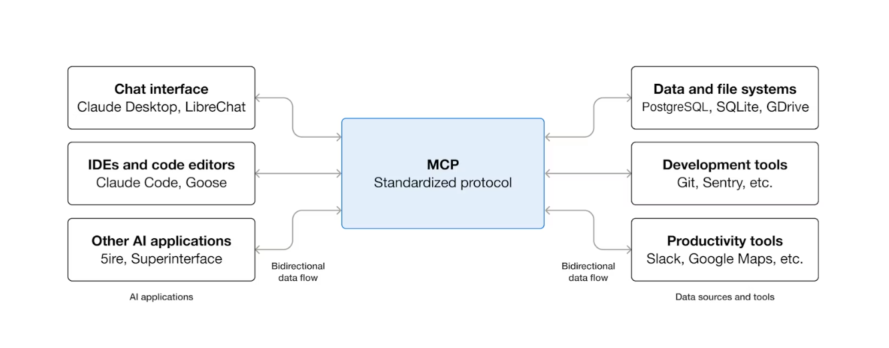
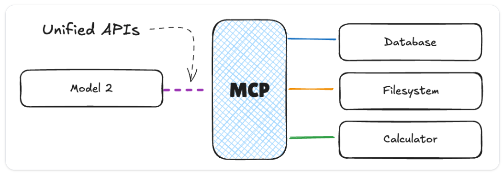
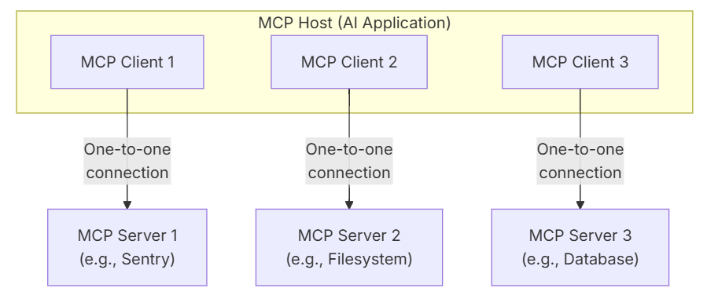
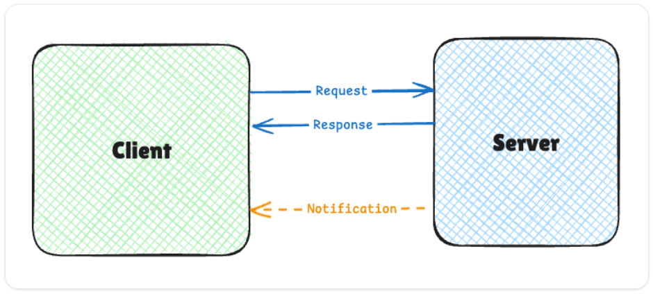
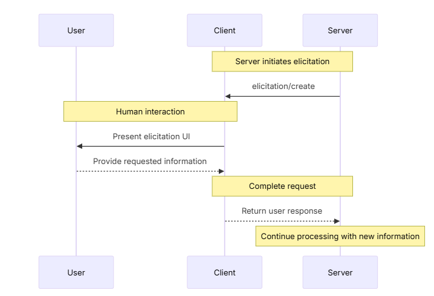
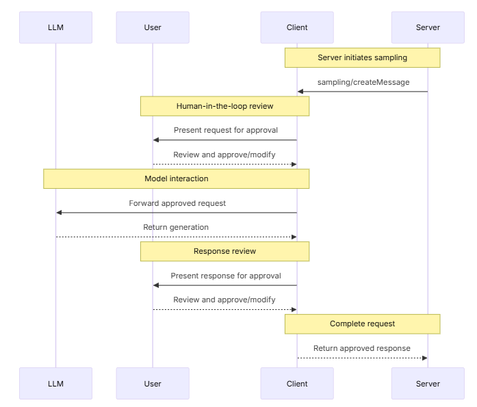
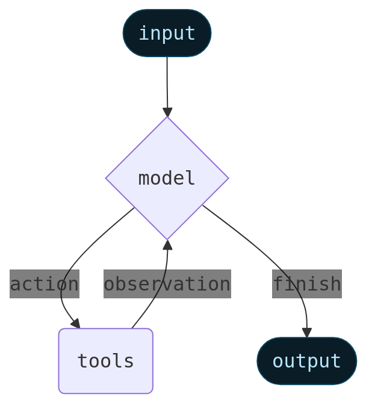
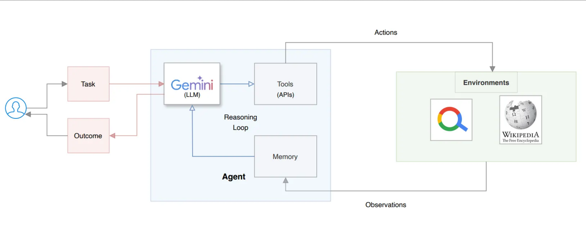

# Model Context Protocol & AI Agents

## Model Context Protocol (MCP)
Model Context Protocol (MCP) is an `open standard` that enables interoperability between AI models, tools, and applications. It allows different AI systems to communicate and share context seamlessly, enhancing their capabilities and user experience.

## What is MCP?
MCP (Model Context Protocol) is an open-source standard for connecting AI applications to external systems.

Using MCP, AI applications like Claude or ChatGPT can connect to data sources (e.g. local files, databases), tools (e.g. search engines, calculators) and workflows (e.g. specialized prompts)—enabling them to access key information and perform tasks.

> Think of MCP like a `USB-C port` for AI applications. Just as USB-C provides a standardized way to connect electronic devices, MCP provides a standardized way to connect AI applications to external systems.



### What can MCP enable?

* Agents can access your Google Calendar and Notion, acting as a more personalized AI assistant.
* Claude Code can generate an entire web app using a Figma design.
* Enterprise chatbots can connect to multiple databases across an organization, empowering users to analyze data using chat.
* AI models can create 3D designs on Blender and print them out using a 3D printer.

### Why does MCP matter?

Depending on where you sit in the ecosystem, MCP can have a range of benefits.

* **Developers**: MCP reduces development time and complexity when building, or integrating with, an AI application or agent.
* **AI applications or agents**: MCP provides access to an ecosystem of data sources, tools and apps which will enhance capabilities and improve the end-user experience.
* **End-users**: MCP results in more capable AI applications or agents which can access your data and take actions on your behalf when necessary.

* **MxN connectivity problem**: Without MCP, integrating multiple AI applications with multiple data sources and tools can lead to a combinatorial explosion of integrations. MCP provides a standardized way to connect AI applications to external systems, reducing the number of required integrations from MxN to **M+N**.



## Architecture

### Scope

The Model Context Protocol includes the following projects:

* [MCP Specification](https://modelcontextprotocol.io/specification/latest): A specification of MCP that outlines the implementation requirements for clients and servers.
* [MCP SDKs](/docs/sdk): SDKs for different programming languages that implement MCP.
* **MCP Development Tools**: Tools for developing MCP servers and clients, including the [MCP Inspector](https://github.com/modelcontextprotocol/inspector)
* [MCP Reference Server Implementations](https://github.com/modelcontextprotocol/servers): Reference implementations of MCP servers.

> MCP focuses solely on the protocol for context exchange — it does not dictate
  how AI applications use LLMs or manage the provided context.

### Participants

MCP follows a client-server architecture where an MCP host — an user-facing AI application that end-users interact with directly. like [VS Code](https://code.visualstudio.com/), [Claude Code](https://www.anthropic.com/claude-code), [Claude Desktop](https://www.claude.ai/download), Hugginf Face inference library or any AI application built in library like Langchain -  coordinates and manages one or multiple MCP clients — establishes connections to one or more MCP servers. The MCP host accomplishes this by creating one MCP client for each MCP server. Each MCP client maintains a dedicated one-to-one connection with its corresponding MCP server.

The key participants in the MCP architecture are:

* **MCP Host**: The AI application that coordinates and manages one or multiple MCP clients. Hosts initiate connections to MCP Servers and orchestrate the overall flow between user requests, LLM processing, and external tools.
* **MCP Client**: A component that maintains a connection to an MCP server and obtains context from an MCP server for the MCP host to use. Each Client maintains a `1:1 connection` with a single Server, handling the protocol-level details of MCP communication and acting as an intermediary between the Host’s logic and the external Server.
* **MCP Server**: An external program or servicethat provides context to MCP clients, exposing `capability` (tools, resources, and prompts) via the MCP protocol.

**For example**: Visual Studio Code acts as an MCP host. When Visual Studio Code establishes a connection to an MCP server, such as the [Sentry MCP server](https://docs.sentry.io/product/sentry-mcp/), the Visual Studio Code runtime instantiates an MCP client object that maintains the connection to the Sentry MCP server.<br/>
When Visual Studio Code subsequently connects to another MCP server, such as the [local filesystem server](https://github.com/modelcontextprotocol/servers/tree/main/src/filesystem), the Visual Studio Code runtime instantiates an additional MCP client object to maintain this connection, hence maintaining a one-to-one
relationship of MCP clients to MCP servers.

> A lot of content uses ‘Client’ and ‘Host’ interchangeably. Technically speaking, the host is the user-facing application, and the client is the component within the host application that manages communication with a specific MCP Server.



Note that **MCP server** refers to the program that serves context data, regardless of where it runs. <br/>
MCP servers can execute **locally** (on the same machine as the Host) or **remotely** (over a network).<br/> 
For example, when Claude Desktop launches the [filesystem server](https://github.com/modelcontextprotocol/servers/tree/main/src/filesystem), the server runs locally on the same machine because it uses the `STDIO`
transport. This is commonly referred to as a `local` MCP server. <br/>
The official [Sentry MCP server](https://docs.sentry.io/product/sentry-mcp/) runs on the Sentry platform, and uses the `Streamable HTTP` transport. This is commonly referred to as a `remote` MCP server.

### Layers

MCP consists of two layers:

* **Data layer**: Defines the JSON-RPC (a lightweight remote procedure call protocol encoded in JSON) based protocol for client-server communication, including lifecycle management, and core primitives, such as tools, resources, prompts and notifications.
* **Transport layer**: Defines the communication mechanisms and channels that enable data exchange between clients and servers, including transport-specific connection establishment, message framing, and authorization.

Conceptually the data layer is the inner layer (protocol), while the transport layer is the outer layer (communication).

#### Data layer

The data layer implements a [JSON-RPC 2.0](https://www.jsonrpc.org/) based exchange protocol that defines the message structure and semantics.
This layer includes:

* **Lifecycle management**: Handles connection initialization, capability negotiation, and connection termination between clients and servers
* **Server features**: Enables servers to provide core functionality including tools for AI actions, resources for context data, and prompts for interaction templates from and to the client
* **Client features**: Enables servers to ask the client to sample from the host LLM, elicit input from the user, and log messages to the client
* **Utility features**: Supports additional capabilities like notifications for real-time updates and progress tracking for long-running operations

- 3 message types:
  * **Requests**: Client-to-server or server-to-client messages, with unique ID, method name to invoke, and parameters (if any)
  * **Responses**: Replies to requests containing results or error information, with same ID as the corresponding request, a result (if successful), or an error object (if failed)
  * **Notifications**: One-way messages that do not expect a response, typically sent from Server to Client to inform about events or state changes

  

#### Transport layer

The transport layer manages communication channels and authentication between clients and servers. It handles connection establishment, message framing, and secure communication between MCP participants.

MCP supports two transport mechanisms:

* **Stdio transport**: Uses standard input/output streams for direct process communication between local processes on the same machine, providing optimal performance with no network overhead.

  [🐍 mcp-server-time](./mcp-server-time.ipynb) `uvx` install using stdio transport.

  [🧪 mcp-server-filesystem](./mcp-server-filesystem.ipynb) `npx` install using stdio transport.

* **Streamable HTTP transport**: Uses HTTP POST for client-to-server messages with optional Server-Sent Events for streaming capabilities. This transport enables remote server communication and supports standard HTTP authentication methods including bearer tokens, API keys, and custom headers. MCP recommends using OAuth to obtain authentication tokens.

  [🧪 mcp-server-everything](./mcp-server-everything.ipynb) with Streamable HTTP transport.

The transport layer abstracts communication details from the protocol layer, enabling the same JSON-RPC 2.0 message format across all transport mechanisms.

## Versioning

The Model Context Protocol uses string-based version identifiers following the format
`YYYY-MM-DD`, to indicate the last date backwards incompatible changes were made.

### Negotiation

Version negotiation happens during `initialization`. Clients and
servers **MAY** support multiple protocol versions simultaneously, but they **MUST**
agree on a single version to use for the session.

The protocol provides appropriate error handling if version negotiation fails, allowing
clients to gracefully terminate connections when they cannot find a version compatible
with the server.

[🔗Check available schema](https://github.com/modelcontextprotocol/modelcontextprotocol/tree/main/schema)

## Servers

MCP servers are programs that expose specific `capabilities` to AI applications through standardized protocol interfaces.

Servers provide functionality through three building blocks:

| Feature       | Explanation                                                                                                                                                                             | Examples                                                           | Who controls it |
| ------------- | --------------------------------------------------------------------------------------------------------------------------------------------------------------------------------------- | ------------------------------------------------------------------ | --------------- |
| **Tools**     | Functions that your LLM can actively call, and decides when to use them based on user requests. Tools can write to databases, call external APIs, modify files, or trigger other logic. | Search flights<br />Send messages<br />Create calendar events      | Model           |
| **Resources** | Passive data sources that provide read-only access to information for context, such as file contents, database schemas, or API documentation.                                           | Retrieve documents<br />Access knowledge bases<br />Read calendars | Application     |
| **Prompts**   | Pre-built instruction templates that tell the model to work with specific tools and resources.                                                                                          | Plan a vacation<br />Summarize my meetings<br />Draft an email     | User            |

### Tools

Tools enable AI models to perform actions. Each tool defines a specific operation with `typed` _inputs_ and _outputs_. The model requests tool execution based on context.

Tools are schema-defined interfaces that LLMs can invoke. MCP uses JSON Schema for validation. Each tool performs a single operation with clearly defined inputs and outputs. Tools may require user consent prior to execution, helping to ensure users maintain control over actions taken by a model.

**Protocol operations:**

| Method       | Purpose                  | Returns                                |
| ------------ | ------------------------ | -------------------------------------- |
| `tools/list` | Discover available tools | Array of tool definitions with schemas |
| `tools/call` | Execute a specific tool  | Tool execution result                  |

**Example tool definition:**

```typescript  theme={null}
{
  name: "searchFlights",
  description: "Search for available flights",
  inputSchema: {
    type: "object",
    properties: {
      origin: { type: "string", description: "Departure city" },
      destination: { type: "string", description: "Arrival city" },
      date: { type: "string", format: "date", description: "Travel date" }
    },
    required: ["origin", "destination", "date"]
  }
}
```

### Resources

Resources provide structured access to information that the AI application can retrieve and provide to models as context.

Resources expose data from files, APIs, databases, or any other source that an AI needs to understand context. Applications can access this information directly and decide how to use it - whether that's selecting relevant portions, searching with embeddings, or passing it all to the model.
It's more like a GET (read-only) request to a REST API for data access than an active function call.

Each resource has a unique URI (e.g., `file:///path/to/document.md`) and declares its MIME type for appropriate content handling.

Resources support two discovery patterns:

* **Direct Resources** - fixed URIs that point to specific data. Example: `calendar://events/2026` - returns calendar availability for 2026
* **Resource Templates** - dynamic URIs with parameters for flexible queries. Example:
  * `travel://activities/{city}/{category}` - returns activities by city and category
  * `travel://activities/barcelona/museums` - returns all museums in Barcelona

Resource Templates include metadata such as title, description, and expected MIME type, making them discoverable and self-documenting.

**Protocol operations:**

| Method                     | Purpose                         | Returns                                |
| -------------------------- | ------------------------------- | -------------------------------------- |
| `resources/list`           | List available direct resources | Array of resource descriptors          |
| `resources/templates/list` | Discover resource templates     | Array of resource template definitions |
| `resources/read`           | Retrieve resource contents      | Resource data with metadata            |
| `resources/subscribe`      | Monitor resource changes        | Subscription confirmation              |

### Prompts

Prompts provide reusable templates. They allow MCP server authors to provide parameterized prompts for a domain, or showcase how to best use the MCP server.

Prompts are structured templates that define expected inputs and interaction patterns. They are user-controlled, requiring explicit invocation rather than automatic triggering. Prompts can be context-aware, referencing available resources and tools to create comprehensive workflows. Similar to resources, prompts support parameter completion to help users discover valid argument values.

**Protocol operations:**

| Method         | Purpose                    | Returns                               |
| -------------- | -------------------------- | ------------------------------------- |
| `prompts/list` | Discover available prompts | Array of prompt descriptors           |
| `prompts/get`  | Retrieve prompt details    | Full prompt definition with arguments |

#### Example: Streamlined Workflows

Prompts provide structured templates for common tasks. In the travel planning context:

**"Plan a vacation" prompt:**

```json  theme={null}
{
  "name": "plan-vacation",
  "title": "Plan a vacation",
  "description": "Guide through vacation planning process",
  "arguments": [
    { "name": "destination", "type": "string", "required": true },
    { "name": "duration", "type": "number", "description": "days" },
    { "name": "budget", "type": "number", "required": false },
    { "name": "interests", "type": "array", "items": { "type": "string" } }
  ]
}
```

## Clients

In addition to making use of context provided by servers, clients may provide several features to servers. These client features allow server authors to build richer interactions.

| Feature         | Explanation                                                                                                                                                                                       | Example                                                                                                                                |
| --------------- | ------------------------------------------------------------------------------------------------------------------------------------------------------------------------------------------------- | -------------------------------------------------------------------------------------------------------------------------------------- |
| **Elicitation** | Elicitation enables servers to request specific information from users during interactions, providing a structured way for servers to gather information on demand.                               | A server booking travel may ask for the user's preferences on airplane seats, room type or their contact number to finalise a booking. |
| **Roots**       | Roots allow clients to specify which directories servers should focus on, communicating intended scope through a coordination mechanism.                                                          | A server for booking travel may be given access to a specific directory, from which it can read a user's calendar.                     |
| **Sampling**    | Sampling allows servers to request LLM completions through the client, enabling an agentic workflow. This approach puts the client in complete control of user permissions and security measures. | A server for booking travel may send a list of flights to an LLM and request that the LLM pick the best flight for the user.           |

### Elicitation

Elicitation enables servers to request specific information from users during interactions, creating more dynamic and responsive workflows.

Elicitation provides a structured way for servers to gather necessary information on demand. Instead of requiring all information up front or failing when data is missing, servers can `pause` their operations to request specific inputs from users. This creates more flexible interactions where servers adapt to user needs rather than following rigid patterns.

**Elicitation flow:**



<sub>The flow enables dynamic information gathering. Servers can request specific data when needed, users provide information through appropriate UI, and servers continue processing with the newly acquired context.</sub>

**Elicitation components example:**

```typescript  theme={null}
{
  method: "elicitation/requestInput",
  params: {
    message: "Please confirm your Barcelona vacation booking details:",
    schema: {
      type: "object",
      properties: {
        confirmBooking: {
          type: "boolean",
          description: "Confirm the booking (Flights + Hotel = $3,000)"
        },
        seatPreference: {
          type: "string",
          enum: ["window", "aisle", "no preference"],
          description: "Preferred seat type for flights"
        },
        roomType: {
          type: "string",
          enum: ["sea view", "city view", "garden view"],
          description: "Preferred room type at hotel"
        },
        travelInsurance: {
          type: "boolean",
          default: false,
          description: "Add travel insurance ($150)"
        }
      },
      required: ["confirmBooking"]
    }
  }
}
```

#### User Interaction Model

Elicitation interactions are designed to be clear, contextual, and respectful of user autonomy:

  - **Request presentation**: Clients display elicitation requests with clear context about which server is asking, why the information is needed, and how it will be used. The request message explains the purpose while the schema provides structure and validation.

  - **Response options**: Users can provide the requested information through appropriate UI controls (text fields, dropdowns, checkboxes), decline to provide information with optional explanation, or cancel the entire operation. Clients validate responses against the provided schema before returning them to servers.

  - **Privacy considerations**: Elicitation never requests passwords or API keys. Clients warn about suspicious requests and let users review data before sending.

### Roots

Roots define filesystem boundaries for server operations, allowing clients to specify which directories servers should focus on.

Roots are a mechanism for clients to communicate filesystem access boundaries to servers. They consist of file URIs that indicate directories where servers can operate, helping servers understand the scope of available files and folders. While roots communicate intended boundaries, they do not enforce security restrictions. Actual security must be enforced at the operating system level, via file permissions and/or sandboxing.

**Root structure:**

```json  theme={null}
{
  "uri": "file:///Users/agent/travel-planning",
  "name": "Travel Planning Workspace"
}
```

Roots are exclusively filesystem paths and always use the `file://` URI scheme. They help servers understand project boundaries, workspace organization, and accessible directories. The roots list can be updated dynamically as users work with different projects or folders, with servers receiving notifications through `roots/list_changed` when boundaries change.  

#### User Interaction Model

Roots are typically managed automatically by host applications based on user actions, though some applications may expose manual root management:

  - **Automatic root detection**: When users open folders, clients automatically expose them as roots. Opening a travel workspace allows the client to expose that directory as a root, helping servers understand which itineraries and documents are in scope for the current work.

  - **Manual root configuration**: Advanced users can specify roots through configuration. For example, adding `/travel-templates` for reusable resources while excluding directories with financial records.

### Sampling

Sampling allows servers to request language model completions through the client, enabling agentic behaviors while maintaining security and user control.

Sampling enables servers to perform AI-dependent tasks without directly integrating with or paying for AI models. Instead, servers can request that the client — which already has AI model access—handle these tasks on their behalf. This approach puts the client in complete control of user permissions and security measures. Because sampling requests occur within the context of other operations — like a tool analyzing data — and are processed as separate model calls, they maintain clear boundaries between different contexts, allowing for more efficient use of the context window.

**Sampling flow:**  



## MCP Inspector

The MCP Inspector is a development tool that helps developers build and debug MCP servers and clients. It provides a user-friendly interface for inspecting MCP messages, monitoring connections, and testing server capabilities.

```bash
# pypi package
# npx @modelcontextprotocol/inspector uvx <package-name> <args>
npx @modelcontextprotocol/inspector uvx mcp-server-git --repository ./

#npm package
#npx -y @modelcontextprotocol/inspector npx <package-name> <args>
npx -y @modelcontextprotocol/inspector npx @modelcontextprotocol/server-filesystem ./ /tmp

#inspect capabilities
npx -y @modelcontextprotocol/inspector npx @modelcontextprotocol/server-everything stdio

#remote url: set streamable http server, url: https://huggingface.co/mcp?login + auth headers Bearer HUGGINGFACEHUB_API_TOKEN
#set preferences on https://huggingface.co/settings/mcp
npx -y @modelcontextprotocol/inspector 

#direct response using cli
npx -y @modelcontextprotocol/inspector --cli npx @modelcontextprotocol/server-filesystem . --transport stdio --method tools/list

#connect remote using cli + variables
export HUGGINGFACEHUB_API_TOKEN=$(grep -v '^#' .env | grep HUGGINGFACEHUB_API_TOKEN | cut -d '=' -f2) && \
npx -y @modelcontextprotocol/inspector --cli "https://huggingface.co/mcp" --transport http --method tools/call --tool-name hf_whoami --header "Authorization: Bearer $HUGGINGFACEHUB_API_TOKEN"
```

## Develop with MCP

- gradio mcp server

  [🐍 gradio-server](./gradio-server.py)

  ```bash
  uv pip install "gradio[mcp]"
  python ./08/gradio-server.py
  ```

  [Run gradio server](http://localhost:7860/) and check MCP capabilities at [http://localhost:7860/mcp](http://localhost:7860/gradio_api/mcp)

- gradio chat (client + agent)
  
  [🐍 gradio-chat](./gradio-chat.py)

  ```bash
  python ./08/gradio-chat.py
  ```  
- combine api & mcp server

  [🐍 fastapi + fastmcp](./mcp-and-api.py)

  ```bash
  python ./08/mcp-and-api.py
  ```

- mix transport (http & stdio)

  [🐍 transport selection](./mcp-server-chat-history.py)  

  [Run chat api mcp server](http://localhost:8000/) and check MCP capabilities at [http://localhost:8000/mcp](http://localhost:8000/mcp)

## MCP Cons

### **Severe Security Vulnerabilities**

**1. Fundamental Design Flaws**
- The protocol specification mandates session identifiers in URLs, which fundamentally violates security best practices
- The protocol specification doesn't require authentication, leaving it to implementers who often forget
- It's surprising to see a new core protocol introduced in 2025 where security isn't "secure by default"

**2. Critical Attack Vectors**
- Prompt injection vulnerabilities where LLMs will trust anything that can send them convincing sounding tokens, making them extremely vulnerable to confused deputy attacks
- Tool descriptions go straight to the AI model, and attackers can hide instructions there that the AI might follow
- CVE-2025-6514 in the mcp-remote package compromised 437,000+ developer environments through a shell command injection vulnerability

**3. Authentication & Authorization Gaps**
- MCP servers store OAuth tokens for services, and if someone compromises the server, they get all your tokens
- While the protocol offers the option for authentication and provides security recommendations, it does not enforce it by default
- Many deployments run without proper authentication

**4. Data Exposure Risks**
- Unlike traditional account compromises that might trigger suspicious login notifications, using a stolen token through MCP may appear as legitimate API access, making detection more difficult
- Without a robust way to capture the entire "chain of thought," organizations are left with a significant compliance blind spot

### The Context Window Catastrophe

A naive implementation of MCP would describe every single available tool and function to the LLM in every single request, which catastrophically breaks down at scale. This creates several problems:

- **Token Explosion**: Describing thousands of API endpoints, their parameters, and their documentation can easily consume hundreds of thousands of tokens, completely overwhelming the model's context before the user's actual prompt is even considered

- **Cost Spiral**: In pay-per-token LLM pricing, forcing the model to parse massive tool lists on every interaction becomes prohibitively expensive

- **Performance Degradation**: The model drowns in metadata before it can even process the user's actual request

### The Scalability Paradox

While MCP theoretically solves M×N complexity by converting it to M+N, practical implementation reveals different challenges:

- Teams couldn't specialize—they had to be generalists across AI logic, business requirements, and external system APIs
- As the number of AI applications and tools grows, the complexity of managing these integrations becomes overwhelming
- The protocol doesn't address *how* to intelligently select which tools to present to the model at runtime


<details>
<summary>Resources</summary>

[🔗 mcp official](https://modelcontextprotocol.io/)

[🔗 10 dev tools](https://generativeai.pub/model-context-protocol-mcp-10-must-try-mcp-servers-for-developers-4cf054836308) | [🔗 6 dev mcp](https://medium.com/coding-nexus/6-mcp-servers-every-developer-needs-to-try-622b3e639403)

[🔗 graphiti mcp](https://github.com/getzep/graphiti/tree/main/mcp_server)

</details>

---

# Runtime & Context
Runtime context allows passing dynamic information to AI agents at invocation time. This enables agents to adapt their behavior based on user-specific data, session details, or other contextual information.

## Overview

**Context engineering** is the practice of building dynamic systems that provide the right information and tools, in the right format, so that an AI application can accomplish a task. Context can be characterized along two key dimensions:

1. By **mutability**:

* **Static context**: Immutable data that doesn't change during execution (e.g., user metadata, database connections, tools)
* **Dynamic context**: Mutable data that evolves as the application runs (e.g., conversation history, intermediate results, tool call observations)

2. By **lifetime**:

* **Runtime context**: Data scoped to a single run or invocation
* **Cross-conversation context**: Data that persists across multiple conversations or sessions

<Tip>

  Runtime context refers to local context: data and dependencies your code needs to run. It does **not** refer to:

  * The LLM context, which is the data passed into the LLM's prompt.
  * The "context window", which is the maximum number of tokens that can be passed to the LLM.

  Runtime context is a form of `dependency injection` and can be used to enhance the LLM context, providing dependencies to tools, agents, and workflow nodes.
</Tip>

LangChain/LangGraph provides three ways to manage context, which combines the mutability and lifetime dimensions:

| Context type                                                                                | Description                                            | Mutability | Lifetime           | Access method                           |
| ------------------------------------------------------------------------------------------- | ------------------------------------------------------ | ---------- | ------------------ | --------------------------------------- |
| **Static runtime context**                                    | User metadata, tools, db connections passed at startup | Static     | Single run         | `context` argument to `invoke`/`stream` |
| **Dynamic runtime context (state)**                     | Mutable data that evolves during a single run          | Dynamic    | Single run         | state object                  |
| **Dynamic cross-conversation context (store)**| Persistent data shared across conversations            | Dynamic    | Cross-conversation | persistent store                         |

### Static runtime context

**Static runtime context** represents immutable data like user metadata, tools, and database connections that are passed to an application at the start of a run via the `context` argument to `invoke`/`stream`. This data does not change during execution.

### Dynamic runtime context

**Dynamic runtime context** represents mutable data that can evolve during a single run and is managed through a `state` object. This includes conversation history, intermediate results, and values derived from tools or LLM outputs. It acts as `short-term memory` during a run.

### Dynamic cross-conversation context

**Dynamic cross-conversation context** represents persistent, mutable data that spans across multiple conversations or sessions and is managed through a `store`. This includes user profiles, preferences, and historical interactions. It acts as `long-term memory` across multiple runs. This can be used to read or update persistent facts (e.g., user profiles, preferences, prior interactions).

[🐍 Runtime & Context](./runtime-context.ipynb)

---

# AI Agents

Agents combine language `models` with `tools` to create systems that can reason about tasks, decide which tools to use, and iteratively work towards solutions.

> Agent: model + tools

[🔗 An LLM Agent runs tools in a loop to achieve a goal](https://simonwillison.net/2025/Sep/18/agents/).
An agent runs until a stop condition is met - i.e., when the model emits a final output or an iteration limit is reached.

**Graph**

A `graph`-based agent runtime using consists of `nodes` (steps) and `edges` (connections) that define how your agent processes information. The agent moves through this graph, executing nodes like the model node (which calls the model), the tools node (which executes tools), or middleware.



**ReAct** 

ReAct stands for `Reasoning` and `Acting`. At its core, a ReAct agent mimics the way humans approach problems:

- **Observation** — The agent perceives the environment or receives input.
- **Reasoning** — It internally thinks through possible actions, evaluates options, and predicts outcomes.
- **Action** — Finally, it takes a step in the world, such as querying a database, calling an API, or generating a response.



This cycle allows the agent to `adapt dynamically`, combining logic and actions to solve complex tasks rather than just following a fixed set of instructions.

Agents follow the ReAct pattern, alternating between brief reasoning steps with targeted tool calls and feeding the resulting observations into subsequent decisions until they can deliver a final answer.

[🐍 Agent components](./agent-components.ipynb)

## Multi-Agent Systems

Multi-agent systems coordinate specialized components to tackle complex workflows. However, not every complex task requires this approach — a single agent with the right (sometimes dynamic) tools and prompt can often achieve similar results.

### Why multi-agent?

Multi-agent systems provide one or more of these capabilities:

* 🧠 **Context management**: Provide specialized knowledge without overwhelming the model's context window. If context were infinite and latency zero, you could dump all knowledge into a single prompt — but since it's not, you need patterns to selectively surface relevant information.
* 👥 **Distributed development**: Allow different teams to develop and maintain capabilities independently, composing them into a larger system with clear boundaries.
* 🔀 **Parallelization**: Spawn specialized workers for subtasks and execute them concurrently for faster results.

Multi-agent patterns are particularly valuable when a single agent has _too many `tools`_ and makes poor decisions about which to use, when tasks require specialized knowledge with _extensive `context`_ (long prompts and domain-specific tools), or when you need to enforce _sequential constraints_ that unlock capabilities only after certain conditions are met.

<Tip>

  At the center of multi-agent design is **context engineering** — deciding what information each agent sees. The quality of your system depends on ensuring each agent has access to the right data for its task.
</Tip>

### Patterns

Here are the main patterns for building multi-agent systems, each suited to different use cases:

| Pattern                                                                  | How it works                                                                                                                                                                                        |
| ------------------------------------------------------------------------ | --------------------------------------------------------------------------------------------------------------------------------------------------------------------------------------------------- |
| [🐍 **Subagents**](./agent-subagents.ipynb)             | A main agent coordinates subagents as tools. All routing passes through the main agent, which decides when and how to invoke each subagent.                                                     |
| [🐍 **Handoffs**](./agent-handoffs.ipynb)               | Behavior changes dynamically based on state. Tool calls update a state variable that triggers routing or configuration changes, switching agents or adjusting the current agent's tools and prompt. |
| [🐍 **Skills**](./agent-skills.ipynb)                   | Specialized prompts and knowledge loaded on-demand. A single agent stays in control while loading context from skills as needed.                                                                    |
| [🐍 **Router**](./agent-router.ipynb)                   | A routing step classifies input and directs it to one or more specialized agents. Results are synthesized into a combined response.                                                                 |

#### Choosing a pattern

Use this table to match your requirements to the right pattern:

<div className="compact-first-col">

  | Pattern                                                      | Distributed development | Parallelization | Multi-hop | Direct user interaction |
  | ------------------------------------------------------------ | :---------------------: | :-------------: | :-------: | :---------------------: |
  | [🐍 **Subagents**](./agent-subagents.ipynb) |          ⭐⭐⭐⭐⭐          |      ⭐⭐⭐⭐⭐      |   ⭐⭐⭐⭐⭐   |            ⭐            |
  | [🐍 **Handoffs**](./agent-handoffs.ipynb)    |            —            |        —        |   ⭐⭐⭐⭐⭐   |          ⭐⭐⭐⭐⭐          |
  | [🐍 **Skills**](./agent-skills.ipynb)       |          ⭐⭐⭐⭐⭐          |       ⭐⭐⭐       |   ⭐⭐⭐⭐⭐   |          ⭐⭐⭐⭐⭐          |
  | [🐍 **Router**](./agent-router.ipynb)       |           ⭐⭐⭐           |      ⭐⭐⭐⭐⭐      |     —     |           ⭐⭐⭐           |
</div>


* **Distributed development**: Can different teams maintain components independently?
* **Parallelization**: Can multiple agents execute concurrently?
* **Multi-hop**: Does the pattern support calling multiple subagents in series?
* **Direct user interaction**: Can subagents converse directly with the user?

<Tip>

  You can mix patterns! For example, a **subagents** architecture can invoke tools that invoke custom workflows or router agents. Subagents can even use the **skills** pattern to load context on-demand. The possibilities are endless!
</Tip>

## Popular agent frameworks

| Framework           | Resources                                               |
| ------------------- | -------------------------------------------------- |
| LangChain          | [docs](https://docs.langchain.com/oss/python/langchain/overview) - [gh](https://github.com/langchain-ai/langchain)           |
| LangGraph          | [docs](https://docs.langchain.com/oss/python/langgraph/overview) - [gh](https://github.com/langchain-ai/langgraph)            |
| crewAI            | [docs](https://docs.crewai.com/) - [gh](https://github.com/crewAIInc/crewAI)                  |
| AutoGen -> agent-framework            | [docs](https://microsoft.github.io/autogen/stable/user-guide/agentchat-user-guide/index.html) - [gh](https://github.com/microsoft/autogen) -> [agent-framework](https://github.com/microsoft/agent-framework)                |
| smolagents         | [docs](https://huggingface.co/docs/smolagents/index) - [gh](https://github.com/huggingface/smolagents)              |

<details>
<summary>Resources</summary>

[🔗 14 key pillars of Agentic AI](https://levelup.gitconnected.com/building-the-14-key-pillars-of-agentic-ai-229e50f65986)
</details>