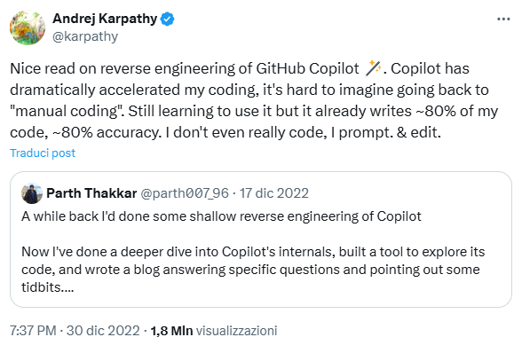
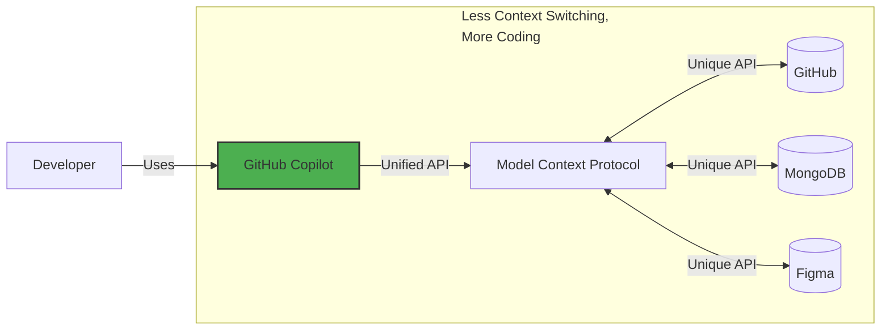
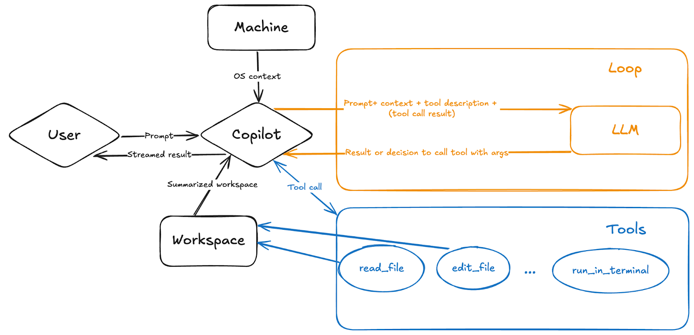

# GitHub Copilot Basics (1/2)

> 🤖 https://github.com/features/copilot
>
> GitHub Copilot is an AI coding assistant that helps you write code faster and with less effort,  
> allowing you to focus more energy on problem solving and collaboration.

## Lesson Goals
- Understand what Copilot is and how it relates to LLMs
- Discover Copilot's features
- Learn about limitations, risks, and best practices
- Integrate Copilot into your daily workflow

**Please be patient:** This lesson starts from the basics. If you already have experience with Copilot or similar tools, we ask for a bit of patience. If you think sharing your experiences or suggestions could be useful, feel free to do so — they will be valuable for everyone!

### Lesson 1

1. Copilot Overview
1. Getting Started (Completition, Ask, Edit)
1. Customization & Debug
1. Agent mode & Model Context Protocol
1. A short note on costs

### Lesson 2

1. Code Review (Local and Remote)
1. GitHub Coding Agent
1. Custom Agents (handoff)
1. Excercise: Refactor a legacy app
1. Copilot CLI

## What is Copilot ❓

**Let's start with what it is NOT!**
Copilot is not a model. We don't use it because it has more code knowledge than other models. The "brain" behind Copilot is exactly the same as what we have on ChatGPT, Gemini, Claude, etc.

In 2023 Copilot switched from using Codex (based on GPT-3) to GPT-4 and later opened up to other frontier models.

**So what is it?**
It is a client/server system that, by orchestrating language models trained on code and text, adds several layers of integration and control.

Main layers:
1. Base models – trained on large corpora of public repositories and technical text.
2. Ingestion & Context Builder – collects the open file buffer, selection, other related files, recent chat messages, any terminal errors.
3. Dynamic Prompt Engineering – internally builds an enriched prompt (including snippets, policy instructions) before sending it to the model.
4. Policy & Safety Layer – filters to remove sensitive content, code with non-compliant licenses (pattern matching), disallow potentially dangerous suggestions.
5. Ranking / Post-processing – when there are multiple candidate completions, selects and orders the one shown (you can cycle through alternatives).
6. Telemetry & Feedback Loop – anonymous acceptance/rejection data (if allowed) to improve future relevance.

<details>
<summary>Copilot architecture diagram 🏗️</summary>

```
┌──────────────────────────────────────────────────────────────────────────────┐
│                 VS Code / Visual Studio / CLI / Copilot Web                  │
├──────────────────────────────────────────────────────────────────────────────┤
│  Editor Buffer      │  File Context     │  Selection/Cursor │  Language      │
│  - Current code     │  - Open files     │  - Position       │  - JS/Python   │
│  - Comments         │  - Projects       │  - Selection      │  - Markdown    │
│  - History          │  - Dependencies   │  - Intention      │  - YAML/JSON   │
└─────────────────────────────────────┬────────────────────────────────────────┘
                                      │
                                      ▼ Context Collection
┌──────────────────────────────────────────────────────────────────────────────┐
│                          GitHub Copilot Service                              │
├──────────────────────────────────────────────────────────────────────────────┤
│                                                                              │
│  ┌─────────────────┐  ┌──────────────────┐  ┌─────────────────────────────┐  │
│  │ Context Builder │  │ Prompt Composer  │  │ Policy & Safety             │  │
│  │                 │  │                  │  │                             │  │
│  │ • File content  │  │ • System prompt  │  │ • License filtering         │  │
│  │ • Code around   │  │ • Code context   │  │ • Sensitive data detection  │  │
│  │ • Related files │  │ • User intent    │  │ • Output sanitization       │  │
│  │ • Dependencies  │  │ • Few-shot ex.   │  │ • Content moderation        │  │
│  └─────────────────┘  └──────────────────┘  └─────────────────────────────┘  │
│           │                      │                          │                │
│           ▼                      ▼                          ▼                │
│  ┌─────────────────────────────────────────────────────────────────────────┐ │
│  │                    LLM Inference Engine                                 │ │
│  │                                                                         │ │
│  │  ┌──────────────┐  ┌──────────────┐  ┌──────────────┐                   │ │
│  │  │   GPT-4o     │  │   Gemini     │  │   Sonnet     │  ... others       │ │
│  │  │              │  │              │  │              │                   │ │
│  │  └──────────────┘  └──────────────┘  └──────────────┘                   │ │
│  └─────────────────────────────────────────────────────────────────────────┘ │
│                                     │                                        │
│                                     ▼                                        │
│  ┌─────────────────────────────────────────────────────────────────────────┐ │
│  │                     Ranking & Post-processing                           │ │
│  │                                                                         │ │
│  │ • Multiple completions ranking      • Response filtering                │ │
│  │ • Quality scoring                   • Streaming optimization            │ │
│  │ • Relevance assessment              • Format standardization            │ │
│  └─────────────────────────────────────────────────────────────────────────┘ │
│                                     │                                        │
└─────────────────────────────────────┼────────────────────────────────────────┘
                                      ▼ Suggestions Stream
┌──────────────────────────────────────────────────────────────────────────────┐
│                           Editor Integration                                 │
├──────────────────────────────────────────────────────────────────────────────┤
│  Inline Suggestions    │  Chat Interface     │  Actions & Commands           │
│  - Ghost text          │  - Explain code     │  - Generate tests             │
│  - Tab to accept       │  - Refactor         │  - Fix problems               │
│  - Alt+] next option   │  - Generate docs    │  - Optimize code              │
└──────────────────────────────────────────────────────────────────────────────┘
                                      │
                                      ▼ Usage Analytics
┌──────────────────────────────────────────────────────────────────────────────┐
│                         Telemetry & Feedback                                 │
├──────────────────────────────────────────────────────────────────────────────┤
│ • Acceptance rates      • Performance metrics    • Quality feedback          │
│ • Usage patterns        • Error tracking         • Model improvement         │
└──────────────────────────────────────────────────────────────────────────────┘
```

</details>

<p></p>

**Fun:**
- [Reverse Engineering GitHub Copilot Prompts](https://systemweakness.com/how-i-reverse-engineering-github-copilot-prompt-s-with-a-single-input-a799f6463685) 🕵️‍♂️
- [Copilot internals](https://thakkarparth007.github.io/copilot-explorer/posts/copilot-internals) (outdated) 🧩

## How useful is it? 📈

GitHub Study (survey >2,000 devs + controlled experiment)  
<https://github.blog/news-insights/research/research-quantifying-github-copilots-impact-on-developer-productivity-and-happiness/>

Key findings (ultra concise):
- Beyond speed: perceived productivity includes flow, focus, satisfaction (SPACE framework approach).
- Satisfaction: ~60–75% report greater fulfillment, less frustration, more “interesting” work.
- Flow & mental energy: 73% feel they stay “in flow” more easily; 87% preserve mental effort for repetitive tasks.
- Measured speed: HTTP server JS task completed on average 55% faster with Copilot (1h11m vs 2h41m) – higher success rate (78% vs 70%).
- Repetitive tasks: >90% perceive faster completion.

<details>
<summary>What did Karpathy think about Copilot in 2022? 🤔</summary>



</details>

## Copilot Main Features ✨

- Code completion ⚡
  - Autocomplete-style suggestions.
- Next Edit Suggestions (NES) 🧭
  - Predict the location of the next edit you are likely to make.
- Copilot Chat 💬
  - A chat interface that lets you ask coding-related questions.
- Copilot Edits mode ✍️
  - Make changes across multiple files maintaining granular control.
- Copilot Agent mode 🤖
  - Let Copilot to autonomously edit your code, using various tools.
- Model-Context-Protocol 🔌
  - Extend Copilot with multiple capabilities by integrating different tools.
- Copilot coding agent 🛠️
  - An autonomous AI agent that can make code changes for you.
- Copilot code review 🧐
  - AI-generated code review suggestions to help you write better code.
- Copilot pull request summaries 📝
  - AI-generated summaries of the changes that were made in a pull request.
- Copilot custom instructions 📚
  - Enhance Copilot Chat responses by providing contextual details.
- Copilot Extensions 🧩
  - Integrates the power of external tools into GitHub Copilot Chat.
- Copilot CLI 💻
  - A command line interface that lets you use Copilot from within the terminal.
- And more...

## Exercise 01 🏋️ {#exercise-01}

**Getting started**

You have been assigned to a project you are not familiar with and are asked to make some changes.

**Workflow:**

1. Use Copilot to help remember a terminal command (es. activate venv) 🙋
   - `Ctrl+I` in the terminal window
2. Get a project intro from Copilot Chat 📄
   - Prompt: `@workspace Please briefly explain the structure of this project.
     What should I do to run it?`
    - `@workspace` is a specialized [chat participant](https://docs.github.com/en/copilot/reference/cheat-sheet?tool=vscode#chat-participants) that will explore the project repository and try to include relevant additional context.
3. Use Copilot to fix a registration bug 🐛
   - Prompt: `@workspace Students are able to register twice for an activity.
     Where could this bug be coming from?`
    - Go with Chat mode, we want to be cautious at this stage.
4. Try to fix manually and let Copilot suggest you 🛠️
   - Start by a comment: `# Validate student is not already signed up`
   - Check what happens with NES enabled (found a new bug!)
5. Let Copilot generate sample data 📋
   - `Ctrl+I` in the code: `Add 2 more sports related activities, 2 more artistic activities, and 2 more intellectual activities.`
6. Use Copilot to describe our work in the commit message 💬
7. Use Copilot to add a new feature using the Edit mode! 🚀
    - Prompt `Edit the activity cards to add a participants section.
    It will show what participants that are already signed up for that activity as a bulleted list.
    Remember to make it pretty!`
    - Add the context you need to edit (the `static/` folder), but also try it without context and see what happens!
    - Iterate, for example: `Since the participant lists can be long, make them open and close.`
    - Changed your mind? Try Restore Checkpoint.
8. Use Copilot to describe our work in the commit message 💬
9. Using GitHub Copilot within a pull request 🎉

**What did you learn?**

- Learned how to use Copilot inline suggestions in both terminal and code.
- Learned how to use the `@workspace` chat participant.
- Learned how to use the Copilot *Ghost Text* autocompletion.
- Learned how to use the Copilot Next Edit Suggestion.
- Learned how to use Chat and Edits.
- Learned how to restore to a Checkpoint in the chat history.
- Used Copilot to generate commit messages and pull request summaries.

## Exercise 02 🏋️

**Customization and Debug overview**

You're a teacher who creates homework assignments and coding exercises for students. You maintain a static website to share these assignments and want to establish general standards for AI assistants to ensure consistent code quality and project structure.

**Workflow:**

1. Explore the Educational Website Project 🔍
2. Create custom repository Copilot Instructions 📝
   - Create a file named exactly `.github/copilot-instructions.md`
   - Put this content:
     <details>
     <summary>copilot-instructions.md</summary>

     ```
      # Project Description

      This project is an educational website for sharing homework assignments and coding exercises with students. Students can browse, view, and download assignments directly from the portal.

      ## Project Structure

      - [`assignments/`](../assignments/) Each homework assignment is stored in its own subfolder with a consistent structure.
      - [`templates/`](../templates/) Reusable templates for new content
      - [`assets/`](../assets/) Contains the website assets including CSS, JavaScript, images, and configuration files
      - [`index.html`](../index.html) The main website page that serves as a static portal for browsing and viewing assignments. Content is configurable via [`config.json`](../config.json) file to dynamically generate assignment lists and details.

      ## Project Guidelines

      - Maintain consistent styling across all pages
      - Keep file and folder names descriptive and organized

      ## Educational Standards

      When generating content for this project:

      - **Learning-focused**: All content should be designed with clear learning objectives and appropriate difficulty levels
      - **Student-friendly**: Use clear, encouraging language that motivates students
     ```

     </details> 

    - Ask for `Briefly explain this project to me`
3. Play with the Debug View 🐞
4. Use Copilot to describe our work in the commit message 💬
   - Try custom instructions for commit messages
5. Try to add a new assignment using Ask, Edit and Agent mode to see the differences ➕ 
6. Add file-specific custom instruction ⚙️ 
   - `*.instructions.md` files in `.github/instructions/` directory
   - Use `applyTo` in the [frontmatter](https://jekyllrb.com/docs/front-matter/) using [glob syntax](https://code.visualstudio.com/docs/editor/glob-patterns)
   - Put this content:
     <details>
     <summary>assignment.instructions.md</summary>

     ```
      ---
      applyTo: "assignments/**/*.md"
      ---

      # Assignment Markdown Structure Guidelines

      All assignment markdown files should follow these guidelines:

      ## 1. Template Usage

      - Assignment markdown files must follow the structure in [`templates/assignment-template.md`](../../templates/assignment-template.md).
      - The assignment must be created as a `README.md` file
      - Do not remove or skip required sections from the template.

      ## 2. Section Guidance

      The section headers should reflect the structure in the template, including the exact icon usage.

      - **Title**: Replace `[Assignment Title]` with a short, descriptive name (e.g., `Python Basics`, `Loops and Conditionals`, `Functions and Modules`).
      - **Objective**: Write 1-2 sentences summarizing what the student will learn or accomplish. Focus on the main skills or concepts.
      - **Tasks**: For each task:
        - Use a specific, action-oriented task name
        - In the Description, clearly state what the student must do.
        - In Requirements, use bullet points to list the expected outcomes or features. Be specific and measurable
        - Provide example input/output in code blocks if helpful.

      Do not include extra sections unless explicitly specified.
     ```

     </details>
7. Apply the new guidelines in Edit mode to *Games in Python* and create a new assignment with Agent mode 📝 
8. Build reusable prompts with Prompt files 🧩 
   - `*.prompt.md` files in `.github/prompts/` directory
   - Prompts focus on WHAT needs to be done. Instructions focus on the HOW
   - Put this content:
     <details>
     <summary>new-assignment.prompt.md</summary>

     ```
      ---
      mode: agent
      description: Create a new programming homework assignment
      ---

      # Create New Programming Assignment

      Your goal is to generate a new homework assignment for the Mergington High School students.

      ## Step 1: Gather Assignment Information

      If not already provided by the user, ask what the assignment will be about.

      ## Step 2: Create Assignment Structure

      1. Create a new directory in the `assignments` folder with a unique name based on the assignment topic
      1. Create a new file in the directory named `README.md` with the structure from the [assignment-template.md](../../templates/assignment-template.md) file
      1. Fill out the assignment details in the README file
      1. (Optional) Add starter code or attachments if the assignment needs them - add these files to the same assignment folder

      ## Step 3: Update Website Configuration

      Update the assignments list in [config.json](../../config.json) website configuration file to include the new assignment. For the dueDate field, use the current date plus 7 days unless specified otherwise.
     ```

     </details>
9. Create a new assignment using the `/new-assignment` command in the chat window 🆕 
10. Build a custom Chat Mode for brainstorming purposes 💬 
    - `*.agent.md` files in `.github/agents/` directory
    - Custom chat modes change how Copilot behaves, creating specialized experiences
    - Put this content:
      <details>
      <summary>brainstorming.agent.md</summary>

        ```
        ---
        description: 💡 Assignment brainstorming assistant
        name: Brainstorming-Assistant
        tools: ["search"]
        ---

        # 💡 Assignment Brainstorming Assistant

        **BRAINSTORM MODE ACTIVATED** 🚀

        I'm your assignment brainstorming partner for Mergington High School! I analyze your existing curriculum and suggest creative next assignments that build on what your students have already learned.

        ## My Response Style

        Every response follows this format:

        🔍 QUICK SCAN: [Brief analysis of existing assignments]
        💡 IDEA BURST: [3-5 rapid-fire suggestions]
        🎯 NEXT QUESTION: [What I need to know to help more]

        ## Rules

        - ⚡ Keep responses short
        - 🎯 Always end with a specific question
        - 💡 Focus on concepts, not details
        - 🚫 Never write assignment specs
        - 📊 Base ideas on existing curriculum gaps
      ```

      </details>
11. Test the chat mode with questions about new assignments 🧪 

**What did you learn?**

- Set up repository-wide custom instructions to ensure consistent code generation
- Use the Debug view to understand the Copilot internals
- Created targeted custom instructions for specific file types and directories
- Built reusable prompt templates for common tasks like homework assignments
- Configured custom chat modes for specialized workflows
- Configured custom instructions for commit messages

## Exercise 03 🏋️

**Agent & Model Context Protocol (MCP)**

[Model Context Protocol](https://modelcontextprotocol.io/introduction) 🧩 is often referred to as "USB-C for AI": a universal connector that allows GitHub Copilot (and other AI tools) to seamlessly interact with other services.

Essentially, it is a way to describe the capabilities and requirements of a service, so AI tools can easily determine what methods to use and to accurately provide the parameters. An MCP server is providing that interface.



Key Concepts:
- 🏗️ Architecture: Host → Client → Server
- 📡 Protocol: JSON-RPC 2.0
- 🚚 Transport: stdio or HTTP
- 🛠️ Primitives: Tools, Resources, Prompts

We will see MCP in detail in [Module 08 of @websolutespa/ai-crash-course](https://github.com/websolutespa/ai-crash-course/blob/main/08/README.md).

**Excercise**:

In the [Exercise 01](#exercise-01), we were introduced to the Mergington High School's extracurricular activities website, which allowed students to sign up for events. And now we have a problem... More teachers are asking to use it! 🎉

Our fellow teachers have lots of ideas but we can't seem to keep up with all the requests! 😮 To fix this issue, lets give GitHub Copilot an upgrade by enabling Model Context Protocol (MCP). To be more specific, we will add the GitHub MCP server, which will enable a combined workflow of issue management and website upgrades. 🧑‍🚀

**Workflow**:

1. Use this template to practice: 🗂️
   [](https://github.com/new?template_owner=skills&template_name=integrate-mcp-with-copilot&owner=%40me&name=lesson01-integrate-mcp-with-copilot&description=Exercise:+Integrate+Model+Context+Protocol+with+GitHub+Copilot&visibility=private)
2. Start GitHub Codespaces and wait until it is ready 🚀
3. Run the application (F5) ▶️
4. Configure the GitHub MCP server in `.vscode/mcp.json` ⚙️
    <details>
      <summary>.vscode/mcp.json</summary>

      ```json
      {
        "servers": {
          "github": {
            "type": "http",
            "url": "https://api.githubcopilot.com/mcp/"
          }
        }
      }
      ```

      </details>
5. Set Agent Mode and analyze the new available tools 🤖
6. Commit `.vscode/mcp.json` (it is part of the repo!) 💾
7. Analyze the issues opened by other teachers 🕵️‍♂️
8. We want Copilot to help us: 💡
   1. Find new improvement ideas
   2. Navigate the issues opened by others
9. Understand the relationship between Agent Mode, LLM, and Tools 🔗
    <details>
    <summary>Diagram</summary>

    

    </details>
10. Use Copilot to search for similar repositories and get new ideas 🔍
11. Ask Copilot to explore a repository in depth 📖
12. Select an idea and ask Copilot to open a new issue ✍️
    - Tools can also be called manually (e.g., `#create_pull_request`)
13. Now let's figure out which issue to work on first. Ask Copilot how many there are. 🧮
14. Ask it to list the 3 most important ones 📋
15. Select one and ask Copilot to follow these steps: 🛠️
    1. Work on a new branch
    2. Show us the result after finishing
    3. Push the changes and open a pull request
16. Iterate in Agent Mode until the result satisfies us and complete the PR 🔄

**What did you learn?**

- What the Model Context Protocol is in broad terms
- Setting up and connecting the GitHub MCP server to Copilot
- Using natural language to interact with external services through MCP tools

<details>
<summary><strong>Advanced examples</strong> 🚀</summary>


#### Example with Payload CMS (~ the same applies for WordPress, Drupal, etc.)
- MCP server with authenticated HTTP
- Local MCP servers (stdio)
- Make Resources (static and dynamic) available and use them
- Make Prompts available and use them (using resources)
- Make Tools available and use them

**Workflow**:

1. Open `01/exercises/03-mcp`
2. Check `.vscode/mcp.json`
3. Check the configuration of `mcpPlugin` in `src/plugins/index.ts`
4. Use a static resource to enrich a prompt: `src/mcp/participants.resource.ts`
5. Use a dynamic resource: `src/mcp/participantsByName.resource.ts`
6. Use the prompt to count names on a resource: `src/mcp/nameCount.prompt.ts`
7. See how the `Participants` collection is structured in Payload
8. We want to load all participants into the collection
  1. See the tool `src/mcp/addParticipants.tool.ts`
  2. Use the resource `course://participants.md` together with the `addParticipants` tool to populate the collection
9. Now we want to update attendance for specific weeks, use the `updatePresence` tool
10. Create an interface for participants and use the MongoDB MCP to update the data
11. Test the interface with the Playwright MCP

</details>

## Costs and usage limits 💸

- Each of us has a license that costs $19/month
- Completions and requests to models labeled with `0x` are unlimited
- We have 300 *Premium requests* included per calendar month
  - A premium request is a prompt, regardless of the tokens used or how long the agent takes
  - Premium requests are labeled with values greater than 0 (e.g., `0.5x`, `1x`, `2x`, `10x`)
  - After reaching 300 requests, you are blocked. In the future, additional billing may be enabled if needed (please give feedback!)
  - If enabled, extra Premium Request costs 0.04$ per request
- You can check your usage from VS/VS Code